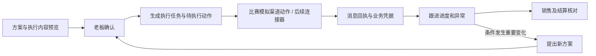
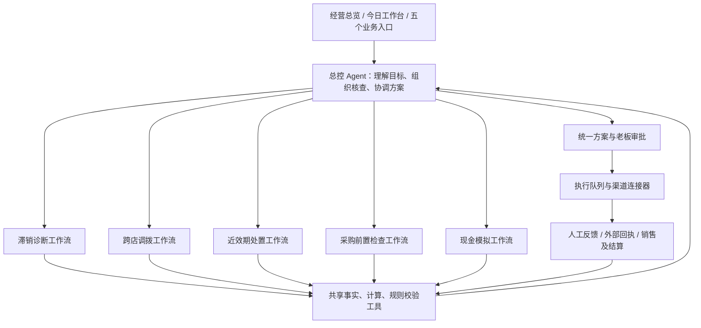

# 货不压钱｜Agent 分工与审批后执行架构

版本：计划 v0.9（三家模型配置入口已预留；API 总费用不限）  
更新日期：2026-10-04  
范围：补充两个经营入口、五大业务能力、统一 Agent 与外部执行连接器的关系。

> 后续用户决定已整合至 [比赛版系统设计草案 v0.8](./HACKATHON_SYSTEM_DESIGN_DRAFT.md)：沿用新版库存文件正式入库能力；业务事实使用生成的测试数据；AI 实际参与分析和工具组织，程序负责计算。飞书、企微、邮箱在本地页面模拟，渠道页面使用正常业务文案，不额外标注“演示／模拟”，由用户现场说明。正常／缺数据分开返回，方案和执行进度由本地后端保存、刷新恢复均已确认。本文第 2.2.2 节及第 4.2 节的真实连接器保留为后续参考。其他待决策项见草案第 12 节。

> 本文描述待开发能力。当前原型已有方案、审批、执行任务及部分人工回填；真实模型编排、微信／企业微信执行、邮箱草稿、飞书通知和自动回执不能据此视为已经接入。本轮同时生成本地 XLSX 数据；没有导入数据库、发送消息、创建外部草稿。后续 v0.9 新增模型配置读取入口；其余模型和渠道执行能力仍待开发。

## 本轮范围更新

- **已确认：调拨由老板／总部决定。** 门店上报实物、库存、收货条件等客观异常，方案的重要变更交老板确认；不设置接收店主观否决步骤。
- **已确认：黑客松采用演示录入路线。** 预置线路、距离、到货条件与运费，展示来源，计算引用同一线路记录；实时算路与物流报价留作后续接入。
- **已确认：退供使用材料驱动流程。** 上传合同、单据、沟通记录，AI 提取并保留原文依据，采购／财务确认后关联退供任务，不要求先接供应商系统。
- **已确认：沿用新版库存文件正式入库。** 保留 v1.4 库存导入、正式快照、语义去重和分析读取，新增数据在此基础上扩展。
- **已确认：飞书、企微、邮箱先做前端模拟。** 渠道页面显示正常的通知、发布、草稿、发送和回执文案，不额外显示“演示／模拟”；内部保留来源字段，用户现场说明范围。
- **已确认：AI 与程序计算分工。** AI 实际理解输入、提取材料、调用工具及依据反馈调整下一步；数量、期限、成本、约束和现金结果由程序计算。已预留 DeepSeek／千问／MiniMax API Key 后端配置入口，开发与比赛 API 总费用不限；有效密钥、具体模型与实际调用仍待接入。
- **已确认：业务数据使用生成的测试数据。** 比赛所需库存、销售、采购、支付和供应商事实由关联样例提供，不要求接入真实 ERP、收银、支付或供应商系统。
- **已确认：正常与缺数据返回不同结果。** 按每项风险所需数据独立判断，缺项保持未知并提示补充。
- **已确认：本地流程与后端保存。** 测试业务和三渠道流程在本地页面模拟；已保存的方案版本、确认人、任务、动作和回执从本地后端重读，刷新后继续跟进。
- **已确认：在线模型断网处理。** 新调用不可用时保留输入和历史结果，提供手工录入／规则计算；历史结果显示原有时间，不伪造新调用。用户已明确今晚交付整个作品；已确认保留单张清晰截图识别＋人工确认，本轮不做 PDF 直接解析，详见比赛版草案第 10.1 节。
- **已确认采购与退供材料输入：** 支持文字或单张清晰截图 → AI 提取 → 人工确认 → 工具检查；采购再衔接老板确认 → 生成订货内容 → 回填，退供衔接条款核查与执行任务。本轮不做 PDF 直接解析，微信／电话／邮箱自动接入不作为首版依赖。

字段、场景数字与详细范围以 [演示数据需求 v0.8](./DEMO_DATA_REQUIREMENTS.md) 的本轮确认表及第 5.4、5.5、6.3、8.4 节为准。更新后仍是开发计划，不是已实现能力说明。

**2026-10-03 最新确认：** 两个入口、五大能力深度、一个总控 Agent + 五个专业工作流 + 共享工具、现有技术的模块化单体及统一数据计算已确认。比赛仅管理员代表老板发起，预览后一次“确认方案并安排执行”；后台仍保存版本、确认人、审批及任务，不安排自提交后再次审批。员工发起与真实多账号留待后续。

## 1. 两个经营入口如何分工

| 入口 | 作用 | 重点展示 |
|---|---|---|
| 经营总览 | 看资金、库存风险和处置结果 | 账户可用资金、库存成本、待关注库存成本、采购付款；结果区区分预计效果、实际到账和基线差额 |
| 今日工作台 | 作出决策、安排执行、跟进异常 | 待评估建议、待我审批、审批后跟进、已完成；每件事可展开动作、负责人、截止时间、证据和下一步 |

建议按互斥的主状态组织列表：建议评估中、等待审批、审批后跟进、已完成。失败、逾期、部分完成、待结算作为子状态或提醒。已审批事项从待审批移到跟进，不删除；历史版本、拒绝、取消可检索。

经营总览聚合结果；工作台保留从建议到执行、结算的完整过程。

## 2. 审批后需要执行动作层



审批页应预先列出渠道、对象、内容、商品、数量、价格、期限和附件。审批覆盖了具体通知内容及对象、且企业授权了自动通知时，可在审批后直接调用通知动作，避免重复确认同一内容。发送给新对象、变更价格或扩大执行范围时，应形成新的授权或方案版本。

### 2.1 业务动作清单

以下为业务动作职责。比赛用前端模拟渠道动作与演示回执呈现；实际平台发送、收货或结算属于后续真实接入能力。

| 业务 | 审批后准备什么 | 可以调用的执行动作 | 用什么确认完成 |
|---|---|---|---|
| 调拨 | 调拨单、商品批次数量、时间和收货要求 | 通知 A 店出库、B 店收货、配送负责人安排运输 | 出库、运输、签收记录；消息发送成功不等于货已调到 |
| 促销 | 活动规则、阶段价、文案、素材、门店执行清单 | 生成可发布素材、创建渠道发布任务、通知门店生效价格 | 活动实际发布、价格已生效、销售记录；仅发广告不等于收银价格已调整 |
| 退供 | 退供申请、明细附件、期望结算方式 | 创建供应商邮件草稿、通知采购员协商、记录回复 | 供应商明确确认、退货验收及结算凭据 |
| 采购调整 | 原数量、建议数量、理由、到货和付款变化 | 给采购员发飞书任务卡、生成修改后的采购文字／单据、准备供应商邮件 | 实际订单确认或变更回执；仅通知采购员不等于采购单已改 |
| 现金模拟 | 假设、方案对比和风险 | 保存模拟结果；用户选择后生成待确认行动方案 | 模拟结束只标记计算完成；不能自动触发付款、下单或促销 |

### 2.2 渠道接入边界

#### 2.2.1 比赛前端演示：用户已确认

| 渠道 | 建议前端流程 |
|---|---|
| 飞书 | 采购任务卡 → 发送通知 → 确认接手 → 提交结果／上报异常 |
| 企业微信（企微） | 促销文案与素材预览 → 发布 → 记录门店执行反馈 |
| 邮箱 | 退供邮件预览 → 保存草稿 → 发送邮件 → 录入供应商回复 |

上表使用产品页面文案；底层采用本地模拟，动作内部携带 `is_demo=true`、`external_write=false`，渠道页面不额外标注“演示／模拟”。比赛阶段不调用这些平台的真实发送接口；库存文件仍沿用已经支持的正式入库流程。模拟回执、业务执行和资金结果分别记录，状态保存和断网运行边界见比赛版设计草案第 7 节。

“消息连接器”指负责把系统内的通知、草稿或发布动作交给消息平台，并接收结果的对接模块。比赛采用本地模拟实现该接口；后续可以换成调用真实平台的实现。

**本地模拟流程与后端保存已确认：** 页面预览、发送、回填均调用本地动作服务，服务把内容快照、版本、状态和回执写入 SQLite。页面刷新后按事项和任务 ID 重读，保持进度。测试数据继续经过真实计算工具；已发送通知、业务已执行和已到账分别记录。该设计尚需在现有持久化基础上补齐渠道及结果记录。

#### 2.2.2 后续真实渠道接入参考：不属于本次比赛要求

**企业微信**

- 试点可提供适用于企业微信的促销文案、商品图片／素材及发布任务，由店员发送并回填执行情况。
- 企业微信可列为后续连接器候选，实施时核验客户租户的客户联系能力、可触达对象、授权、发送流程和限制。
- 本次未核实企业微信群发接口的具体可用条件，不把个人微信自动群发、朋友圈自动发布或全自动客户营销写成已支持能力。
- 即使平台支持创建群发任务，也要分别记录任务创建和实际发送结果；不能默认两者相同。

**邮件**

- 后续试点可生成主题、正文和附件供采购员使用。
- 接入客户授权邮箱后，可以创建邮箱内草稿。以 Microsoft Graph v1.0 为例，创建消息默认保存到草稿箱，发送是后续独立动作；创建草稿也需要邮箱权限。[官方创建草稿说明](https://learn.microsoft.com/en-us/graph/api/user-post-messages?view=graph-rest-1.0)。
- 草稿创建、发送提交、供应商回复、条款确认分别记录。邮件写好不代表供应商同意。
- 具体邮箱类型须在连接器实施前确认，不能将某一邮箱 API 的能力直接套到所有邮箱。

**飞书**

- 接入企业授权的应用机器人，向采购、店长或相应工作群发送任务卡片；消息中包含业务单号、负责人、时限与方案链接。
- 卡片可设计“确认接手”“填写实际结果”“上报异常”等交互。需实现相应回调和业务接口，不能仅发送一张卡片就认为能回写系统。飞书官方案例展示了发送卡片、交互回传及写回数据的分工。[官方交互卡片案例](https://www.feishu.cn/content/7319786721459863556)。
- 自定义群机器人适合通知的场景可先采用；需要复杂交互时按选定应用能力实施，不能假定所有 webhook 都支持交互回调。
- “确认接手”记录负责人已接单，“填写实际结果”还需订单或执行凭据；两种动作不能合并为业务完成。

客户未接渠道时，保留复制文字、下载文件、上传回执的替代入口。渠道授权失效或发送失败时保留待执行任务，允许按原任务重试。

### 2.3 跟进页面要显示什么

演示示例：管理员代表老板确认一笔尚未下单的海盐薯片采购意向，从 100 件调整为 60 件（与 S07 基础单位一致）。以下时间和回执均为模拟。

```text
采购调整任务 #PA-001
负责人：李采购                 截止：今日 16:00

老板已确认                    09:30
飞书任务通知已发送            09:31
采购员已接手                  09:40
供应商邮件草稿已保存          09:41
供应商实际确认数量            待回填
对应付款计划更新              待核对

下一步：采购员提交供应商订单确认
```

如果原订单已确认，须先检查变更条款；不能因为老板内部批准就记录外部订单变更成功。

每条动作至少有：`action_id`、`proposal_id`、`proposal_version`、`task_id`、`action_type`、`connector_id`、`target_ids`、`payload_snapshot`、`approval_scope_ref`、`owner_id`、`due_at`、`status`、`external_ref`、`attempt_count`、`last_error`、`idempotency_key`、`created_at`、`updated_at`。

实际凭据另记：`receipt_id`、`action_id`、`source`、`external_event_id`、`occurred_at`、`received_at`、`evidence_ref`、`verified_by`。演示回执明确标记 `is_demo=true`。

状态分三层保存，页面采用以下方案：

1. **渠道动作（已确认）**：待生成、草稿已保存、待发送、已发送、失败。
2. **业务执行（简化建议待确认）**：待执行、执行中、已完成。部分执行用数量进度表示，异常用“需处理”提醒，取消保留归档原因且不计入正常完成。
3. **结果核算（简化建议待确认）**：待核算、核算中、已核算。待观察／待到账写在下一步说明；部分核销显示到账及剩余金额；无需现金结算也须核对货品、应付等对应凭据。

页面可显示“执行已完成 · 结果待核算”。消息已发送、签收完成和金额核对分别依据自身证据。接手、部分数量、异常、退款／换货／抵款、核销明细继续保存，新页面枚举通过适配层映射现有接口。详见草案第 7.1 节。

审批后执行动作应持久化排队。重复点击、回调重复、超时重试不得造成重复发送或重复生成业务单；外部调用结果不明确时先查询已存在结果，再决定是否重试。调用失败需保留原因和人工处理入口。

## 3. “统一 Agent”表示统一组织任务

统一的是经营目标、共享事实、方案版本、预算、数量预留、审批和执行记录。它不规定全系统只能有一个模型调用，也不要求六个独立模型或六个部署服务。

### 3.1 已确认首版架构

**一个总控 Agent + 五个专业业务工作流 + 共享计算工具 + 受控执行连接器。**



五个工作流都可以按需要调用大模型。模型实例和运行框架可以复用；普通查数、筛选、金额计算直接调用代码工具，无须每次点击都启动模型。

### 3.2 五大能力内部的模型与工具分工

| 专业能力 | 需要模型参与的步骤 | 交给确定性工具的步骤 |
|---|---|---|
| 滞销诊断 | 理解店长反馈、提出待核查原因、选择后续调查 | 覆盖天数、风险规则、批次风险去重、证据查询 |
| 跨店调拨 | 理解指定目的地及例外条件，组织候选评估，解释方案差异 | 候选净需求、容量、效期、运费、数量及比较结果 |
| 近效期处置 | 提取供应商条款、组织调拨／促销／退供组合、生成协商草稿 | 剩余可售时间、数量分配、底价毛利、结算计算 |
| 采购前置检查 | 从微信文字、邮件或单据提取采购意向，识别变更含义 | SKU／单位匹配校验、在途去重、逐日库存、付款计划 |
| 现金模拟 | 将“少采购但不能缺货”等经营目标转为明确假设，解释权衡 | 基线与方案现金事件、需求情景、约束及结果差额 |

复杂核查或规划需要根据工具结果反复选择下一步时，可以将对应工作流独立封装为专业 Agent，形成“总控 Agent + 专业 Agent”的协作结构。首版不要求五个模块都拥有独立自主循环；仅一次提示词生成或普通公式计算不宣称是独立自治 Agent。

无论采用哪种封装，同一批货的预留、审批、事实和外部执行均经过共享服务。不能由调拨、促销、退供分别占用同一份库存，也不能由各个 Agent 自行重复通知、改价或下单。

### 3.3 一条任务怎样调用多种能力

老板提出：“这批坚果库存太高，评估调去文三店，采购也一起检查。”

1. 总控读取目标、指定接收店和当前数据版本。
2. 诊断工作流核查积压是否与销量、上架或采购有关。
3. 调拨工作流计算文三店需求、已有库存、在途、运费与可行数量。
4. 采购工作流检查是否仍有拟采购或已确认订单，需要什么变更条件。
5. 若批次临期，按需调用近效期工作流比较促销和退供。
6. 现金工具汇总相同周期内的流入、流出、费用和基线差额。
7. 总控形成一份统一方案及明确的执行动作，老板确认。
8. 执行队列创建相应通知、文件或邮箱草稿，并跟踪业务凭据。
9. 新事实造成重要变化时重新计算；实质变更交老板确认。

## 4. 跨阶段实施顺序

### 4.1 比赛阶段：渠道方式已确认，开发顺序为建议

1. 复用新版库存文件正式入库及现有方案、审批、执行任务基础。
2. 补齐执行动作、负责人、期限、版本、回执和失败状态。
3. 实现飞书任务卡、企微促销任务、邮箱草稿的前端演示，并将模拟回执关联到工作台。
4. 使用统一演示业务事件展示执行、销售和结算结果。
5. Agent、其他数据接入及业务计算按比赛版草案的范围和待决策项安排。

比赛演示串起“生成方案 → 老板确认 → 前端渠道任务或邮件草稿 → 回填 → 展示资金结果”。模拟来源保留在内部数据及技术文档中，渠道页面按用户要求使用正常业务文案。业务完成及到账仍依赖各自回放事件。

### 4.2 后续客户试点：真实连接器建议

1. 补齐持久化执行动作、负责人、期限、版本、回执和失败状态，工作台能持续跟进。
2. 实现一个真实可用渠道：飞书任务通知与结果回填；没有客户飞书条件时使用已有渠道或人工入口，不强制客户迁移。
3. 增加邮箱草稿；连接器选择客户实际使用的邮箱服务。
4. 增加促销素材包及门店执行反馈，再按客户企业微信条件接发布相关能力。
5. 将总控模型调用与五个业务工作流接到已核对的计算工具，记录输入、工具调用、结果、异常和事实版本。

后续试点可在客户授权后实际创建渠道任务或邮箱草稿，并接收回填。消息发送、业务执行与资金结果分别核对。

采购文字入口已随五大能力深度确认；其检查流程可复用已确认的三渠道前端演示，无需真实平台接口作为前提。
