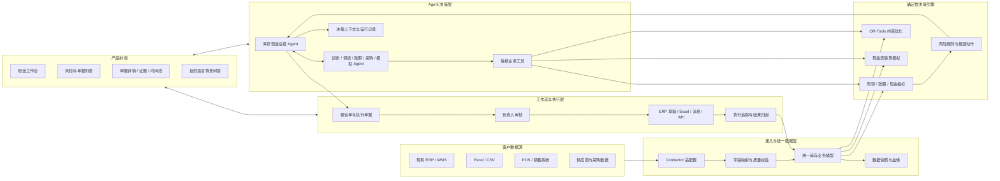
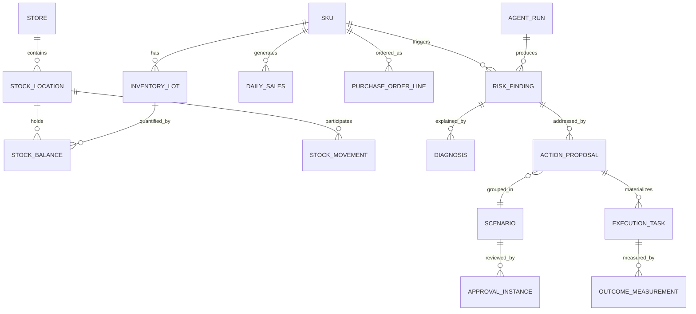
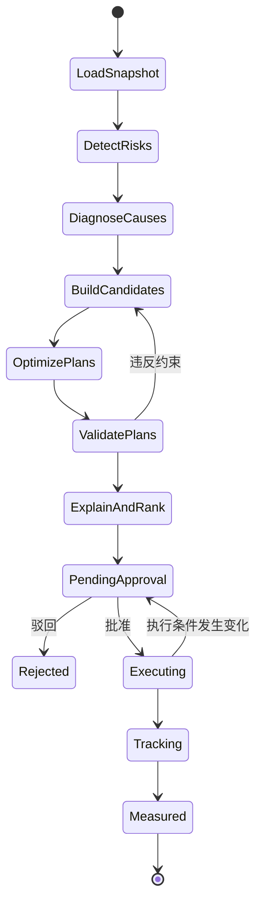
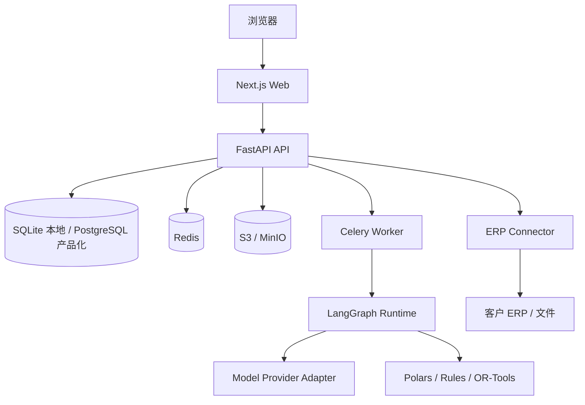

# 库存现金智能体：系统开发架构

> 历史架构规划：本文保留 V1.1 的背景与远期设计，不代表当前已实现能力。当前以[魏的 v1.2 契约](../API_CONTRACT.md)及实际后端为准，已运行规则计算、人工审批和本地待执行任务；真实模型与 ERP 尚未接入。当前结构与限制见[联调说明](FRONTEND_INTEGRATION.md)。

状态：产品架构基线 1.0  
目标：既能在黑客松中完成可信演示，又不把后续产品化道路锁死在某个 ERP 中。

> 2026-10-04 审阅入口：[比赛版系统设计草案 v0.8](./HACKATHON_SYSTEM_DESIGN_DRAFT.md)。已确认：沿用库存文件正式入库；AI 分析与程序计算分工；正常与缺数据分开返回；测试数据与消息连接器流程在本地页面模拟，后端保存方案和执行进度、刷新恢复。飞书、企微、邮箱渠道页面使用正常业务文案。材料识别已确认采用单张清晰截图＋人工确认，本轮不做 PDF 直接解析。其余事项请看草案的「你已确认」「我的建议」「待你决定」。本文保留总体及后续产品化架构参考；比赛已确认沿用现有前端、Python 3.11／FastAPI／SQLite 模块化单体，以及一个总控 Agent + 五个专业工作流 + 共享工具。本文其他候选框架、产品化部署及分级审批示例不属于本轮确认范围，也不表示代码已实现。管理员比赛流程以草案的一次确认并安排执行为准。比赛版草案尚未定稿，当前接口以根目录 `API_CONTRACT.md` v1.4 为准。

2026-10-03 补充计划：[Agent 分工与审批后执行架构](./AGENT_EXECUTION_ARCHITECTURE.md)。该补充明确首版总控 Agent 与五个专业工作流的关系，以及飞书、企微、邮箱相关执行的能力边界；描述的是待开发设计，当前已实现接口仍以根目录 `API_CONTRACT.md` 为准。

## 1. 产品边界

库存现金智能体不是新的 ERP，也不是 ERP 的聊天入口。它是架在客户现有业务系统之上的“库存资金决策与执行层”。

它负责：

1. 读取销售、库存、采购、效期、门店和供应商数据。
2. 通过确定性规则与算法识别关注库存成本和经营风险。
3. 让 Agent 汇总证据；证据不足时组织人工核查，而不是直接断言原因。
4. 用现金事件、约束校验和情景模拟计算预计净现金改善及副作用。
5. 将建议转成可审批的业务单据。
6. 经人工确认后生成 ERP 草稿、Excel、消息或任务。
7. 回收执行结果，衡量真实资金释放并改进策略。

它首期不负责：总账、收银、会员、处方、完整采购与仓储执行。客户原 ERP 仍然是交易记账系统，本产品是跨系统决策中心。当前本地实现使用 SQLite 和合成样例；生产环境再替换为 PostgreSQL 与真实 Connector。

## 2. 总体架构



### 核心原则

- **ERP 解耦：** 上游换系统只替换 Connector，不改 Agent 和决策逻辑。
- **计算与语言分离：** 金额、数量、效期、约束由程序计算；大模型负责理解、归纳、解释和编排。
- **建议与执行分离：** Agent 可以自动生成建议，但任何写回 ERP、改价、停采等副作用默认必须审批。
- **单据化：** 每个建议都有编号、证据、版本、状态、负责人、审批和执行记录。
- **可重放：** 每次决策保存数据快照、规则版本、模型版本、工具输入输出和审批历史。
- **先模块化单体：** 黑客松及早期客户阶段不做微服务；先保持清晰模块边界，规模需要时再拆。

## 3. 从 Odoo 和 ERPNext 借鉴什么

### 3.1 参考 Odoo 的库存物流模型

我们只借鉴成熟的业务概念，不把 Odoo 作为运行依赖。

| 参考概念 | 本产品中的模型 | 价值 |
|---|---|---|
| Warehouse / Location | `warehouse`、`stock_location` | 区分门店、中心仓、待验、在途、报损等位置 |
| Stock Move | `stock_movement` | 所有数量变化都可追踪来源与去向 |
| Picking / Transfer | `transfer_order`、`transfer_line` | 表达跨店调拨的业务单据与执行过程 |
| Lot / Serial | `inventory_lot` | 追踪批号、生产日期和失效日期 |
| Reordering Rule | `replenishment_policy` | 安全库存、补货点、补货周期和起订量 |
| Routes | `fulfillment_route` | 哪些仓店之间允许调拨及成本时效 |

关键做法是采用“库存余额 + 库存事件”双模型：余额用于快速分析，事件用于审计、回放和解释。

### 3.2 参考 ERPNext 的单据工作流

| 参考能力 | 本产品实现 |
|---|---|
| DocType 思路 | 风险、方案、审批、执行任务都使用统一单据元数据 |
| Draft / Submit / Cancel | 明确的状态机，禁止随意覆盖历史数据 |
| Workflow | 按金额、动作类型、门店范围配置审批路径 |
| Role Permission | 总部、区域经理、店长、采购、财务拥有不同可见和操作范围 |
| Timeline | 把 Agent、人工、API 和系统事件展示在同一时间线 |
| Print Format | 生成调拨单、退供函、促销方案和采购调整建议 |

### 3.3 自研且构成竞争力的部分

- 库存资金风险口径及行业知识库。
- 原因诊断的证据链、证据等级与缺项，而不是未经规则支持的数字置信度。
- 多动作组合方案，而不是单点报警。
- 带安全库存、距离、效期、成本和门店能力约束的优化模型。
- 现金释放目标反推和 What-if 模拟。
- 审批前解释、审批后执行、执行后归因的闭环。
- 客户策略和历史执行效果驱动的持续评测。

## 4. 统一领域模型

### 4.1 基础主数据

- `tenant`：客户租户。
- `organization`：连锁总部、区域或业务主体。
- `store`：门店。
- `warehouse`：仓库，可关联门店。
- `stock_location`：具体库存位置。
- `sku`：标准商品。
- `supplier`：供应商。
- `customer_segment`：门店主要顾客群，用于客群匹配诊断。

### 4.2 交易与库存事实

- `stock_balance`：某时点 SKU/批次/库位的可用、预留、在途数量。
- `inventory_lot`：批号、成本、失效日期和可退换条件。
- `stock_movement`：入库、销售、调拨、盘点、退供、报损等事件。
- `daily_sales`：门店-SKU-日期粒度的销量、销售额、毛利和促销标记。
- `purchase_order_line`：已下单、未到货、可取消和预计到货数量。
- `supplier_term`：账期、起订量、退换货窗口和返利约束。
- `replenishment_policy`：安全库存、自动补货开关、周期和上限。

### 4.3 Agent 决策对象

- `risk_finding`：一个可核验的风险事实，例如“预计售罄 168 天，超过阈值 90 天”。
- `diagnosis`：观察命题、证据等级、证据引用、缺项、冲突和排除项。
- `action_proposal`：动作类型、目标、前提、明细、收益、成本和风险。
- `scenario`：一个或多个方案组合及约束参数。
- `approval_instance`：审批路径、意见、签署人和时间。
- `execution_task`：真正需要被执行或写回外部系统的任务。
- `outcome_measurement`：计划值、实际值、差异和归因。
- `agent_run`：一次 Agent 运行的完整可观察记录。

### 4.4 核心关系



## 5. Agent 架构

### 5.1 编排方式

第一阶段使用一个 LangGraph 状态图，不把五个智能体做成五个独立服务。它们是五个拥有不同系统提示、工具权限和输出结构的专业节点，由“库存现金总控 Agent”编排。



### 5.2 五个专业 Agent

| Agent | 输入 | 只读工具 | 结构化输出 |
|---|---|---|---|
| 滞销诊断 Agent | 风险 SKU、门店、历史销售和库存 | 趋势、同店/同品对比、价格、客群、补货记录 | 待核查因素、证据等级、缺项、优先级 |
| 调拨 Agent | 各店库存、需求预测、效期、距离 | 网络优化、安全库存校验、调拨成本 | 调出/调入/数量/批次/收益/风险 |
| 近效期 Agent | 批次和剩余效期 | 售罄概率、促销弹性、退供条件 | 调拨、促销、退供或报损预警组合 |
| 采购刹车 Agent | 现存、在途、采购单、预测、账期 | 采购敞口、现金占用、MOQ 校验 | 暂停、减量、延期、替代和谈判建议 |
| 现金模拟 Agent | 目标金额、期限和业务约束 | 方案求解器、情景比较 | 可行性、动作组合、现金曲线、缺货风险 |

### 5.3 Agent 工具边界

Agent 不直接执行 SQL，也不直接修改 ERP。所有能力通过有 JSON Schema 的工具暴露：

- `get_inventory_snapshot`
- `calculate_sell_through_days`
- `forecast_store_demand`
- `find_transfer_candidates`
- `optimize_transfer_network`
- `simulate_discount_clearance`
- `evaluate_supplier_return`
- `calculate_purchase_exposure`
- `simulate_cash_release`
- `create_proposal_draft`
- `request_approval`
- `create_external_draft`（审批后可用）

每个工具都应有权限、超时、幂等键、输入校验和审计记录。涉及外部写入的工具必须同时满足“已审批 + 当前数据未发生关键变化”。

### 5.4 结构化输出而非自由文本

每个 Agent 都返回 Pydantic 模型。例如调拨建议：

```json
{
  "proposal_type": "store_transfer",
  "sku_id": "SKU-00128",
  "source_store_id": "STORE-013",
  "target_store_id": "STORE-026",
  "lot_id": "LOT-20260831-A",
  "quantity": 40,
  "estimated_cash_release": 3200.00,
  "estimated_transfer_cost": 86.00,
  "source_stockout_probability": 0.04,
  "target_sell_through_days": 27,
  "evidence_ids": ["E-8102", "E-8108"],
  "requires_approval": true
}
```

自然语言解释从这个结构化结果生成，不能反过来从一段文字中解析数量和金额。

## 6. 规则、算法与 AI 的职责划分

| 问题 | 负责组件 | 原因 |
|---|---|---|
| 周转天数、资金占用、近效期天数 | SQL/Polars | 精确、可重复、易审计 |
| 是否超过公司阈值 | 规则引擎 | 规则明确且需要版本管理 |
| 跨门店调拨数量 | OR-Tools | 同时处理安全库存、运输成本、效期等约束 |
| 促销销量弹性 | 统计模型/历史分层估计 | 可用真实数据校准 |
| 原因归纳和证据叙述 | LLM Agent | 适合处理多来源弱信号和表达 |
| 多方案权衡说明 | LLM Agent + 确定性评分 | 保留可解释性并避免模型算错 |
| 写回 ERP | 工作流执行器 | 必须幂等、可重试、可审计 |

建议的方案评分：

```text
方案得分 = 预计净现金改善
         - 调拨/促销/退供成本
         - 缺货风险惩罚
         - 到期报损风险惩罚
         - 执行复杂度惩罚
```

各项权重是客户级配置，保存版本并显示在方案解释中。

## 7. 单据和状态机

### 7.1 建议单生命周期

```text
DETECTED → ANALYZED → PROPOSED → PENDING_APPROVAL
                                  ├→ REJECTED
                                  └→ APPROVED → EXECUTING → COMPLETED → MEASURED
```

规则：

- `PENDING_APPROVAL` 后建议内容不可原地改写；修改必须产生新版本。
- `APPROVED` 只表示允许执行，不表示已写入 ERP。
- `EXECUTING` 前重新检查库存、效期、价格和采购单状态，防止使用过期建议。
- `MEASURED` 保存真实释放金额和计算口径，供后续评测。

### 7.2 调拨单生命周期

```text
DRAFT → APPROVED → RESERVED → SHIPPED → IN_TRANSIT → RECEIVED → CLOSED
          └→ CANCELLED       └→ EXCEPTION
```

每一次状态变化都是 append-only 事件，当前状态是事件投影。即使客户 ERP 只有较简单的状态，也在本产品内保留完整过程。

### 7.3 审批策略示例

- 单店且释放金额低于 5,000 元：店长审批。
- 跨区域调拨：区域经理和物流负责人审批。
- 改价或促销：运营负责人审批。
- 取消采购金额超过 50,000 元：采购负责人和财务审批。
- 任何外部自动写回：客户管理员显式启用，默认只创建草稿。

## 8. API 边界

所有接口使用 `/api/v1` 版本前缀、租户隔离、结构化错误和幂等键。

### 数据接入

- `POST /imports`：上传 Excel/CSV 并返回导入任务。
- `GET /imports/{id}`：查看字段映射、质量问题和处理进度。
- `POST /connectors/{id}/sync`：触发 ERP 增量同步。
- `GET /data-quality/issues`：查看缺字段、异常值和主数据冲突。

### 核查与事实版本

- `POST /risks/{id}/investigations`：发起核查任务。
- `POST /investigations/{id}/feedback`：保存原文并生成待确认结构化草稿。
- `POST /feedback/{id}/confirm`：确认事实版本，重评依赖该事实的方案。
- `POST /feedback/{id}/revisions`：保存纠正或撤回，不删除历史原文。
- `POST /risks/{id}/replan`：请求关联方案重算；失败时返回 `replan_pending`。

### 风险与方案

- `GET /risks`、`GET /risks/{id}`
- `POST /risks/{id}/diagnose`
- `GET /proposals`、`GET /proposals/{id}`
- `POST /proposals/{id}/submit`
- `POST /proposals/{id}/approve`
- `POST /proposals/{id}/reject`
- `POST /proposals/{id}/execute`

### Agent 与模拟

- `POST /agent/runs`：启动分析任务。
- `GET /agent/runs/{id}`：读取节点、工具调用、证据和耗时。
- `POST /scenarios/simulate`：输入目标、期限和约束，返回方案集合。
- `POST /scenarios/{id}/compare`：比较现金、风险和执行成本。

### 执行与追踪

- `GET /execution-tasks`
- `POST /execution-tasks/{id}/retry`
- `POST /webhooks/erp/{connector}`
- `GET /outcomes`、`GET /outcomes/{id}`

## 9. 数据接入策略

### 黑客松

使用标准模板导入：商品、门店、当前库存、批次效期、近 90 天销售、采购在途和补货参数。当前本地附带 `sample-data/ac01_replay.json` 和 SQLite `POST /api/v1/demo/reset`，数据明确标记为合成样例回放。

### 首个试点客户

优先级按以下顺序：

1. 客户 ERP 的只读 API。
2. ERP 定时导出的文件/SFTP。
3. 只读数据库视图。
4. RPA 只作为最后兜底。

每个 Connector 将客户字段映射为统一模型，并输出完整性、新鲜度和一致性评分。低于阈值时，Agent 只能生成“待验证建议”，不能进入自动执行。

### 写回策略

本轮只创建执行任务草稿，`external_write=false`；不自动发货、收货、改价、停采或宣称现金到账。第二阶段才通过 API 创建 ERP 草稿。产品内部的 `external_reference` 保存外部单号，幂等键防止重复创建。

## 10. 技术部署架构

### 10.1 首期模块化单体



建议开发期用 Docker Compose 启动 PostgreSQL、Redis、MinIO；Web/API/Worker 保持本地热更新。交付时支持云端 SaaS、客户 VPC 或单客户私有部署。

### 10.2 代码边界

```text
apps/api
├── routes/            # HTTP 边界，不写业务规则
├── application/       # 用例：审批、执行、创建方案
├── repositories/      # 持久化接口
└── auth/              # 身份、租户、角色与数据范围

services/agent
├── graphs/            # LangGraph 状态图
├── agents/            # 五个专业 Agent
├── tools/             # 受控工具及输入输出模型
├── prompts/           # 可版本化提示词
└── guardrails/        # 权限、数据新鲜度和执行检查

packages/domain
├── inventory/         # 库存与物流领域模型
├── documents/         # 单据、审批与状态机
├── decisions/         # 风险、诊断、方案与结果
└── events/            # 领域事件

packages/analytics
├── metrics/           # 周转和资金指标
├── forecasting/       # 销量预测
└── rules/             # 可版本化风险规则

packages/optimization
├── transfer/          # 调拨网络优化
├── purchasing/        # 采购敞口与刹车建议
└── scenario/          # 现金目标求解
```

禁止 `agents/` 直接依赖数据库实现或外部 ERP SDK；它们只能调用注册工具。这样 Agent 编排可测试，Connector 也能独立替换。

## 11. 安全、合规与可观察性

- 租户字段贯穿所有业务表，并使用行级策略或仓储层强制隔离。
- 门店和区域采用数据范围权限，不只做页面按钮权限。
- 敏感字段加密，凭证进入密钥管理，不进入代码和 Agent 上下文。
- Prompt 中只提供完成任务所需的数据，顾客个人信息默认不送入模型。
- 高影响动作默认人审，审批后执行前再次校验。
- 每次 Agent Run 记录 token、费用、耗时、工具错误、规则版本和最终采纳情况。
- 建立回放集：历史风险、标准诊断、可接受方案区间及不可违反的约束。
- 线上指标至少包含：风险发现准确率、建议采纳率、实际资金释放、缺货增量、报损减少、执行失败率。

## 12. 关键架构决策

1. **不选择 Odoo 或 ERPNext 作为产品运行底座。** 原因是客户 ERP 不统一，深度绑定会把核心产品变成实施项目。
2. **采用独立统一模型。** Odoo 和 ERPNext 都只是参考和可选 Connector。
3. **首期使用单一 Agent 图。** 五个“智能体”是专业节点，不是五套重复基础设施。
4. **PostgreSQL 是产品化业务真相源，SQLite 是当前本地真相源。** 向量数据库不是首期必需品；制度、供应商条款等非结构化知识量增大后再引入。
5. **LLM 不负责精确数学。** 数量、金额、优化和硬约束必须由可测试代码完成。
6. **所有执行都单据化。** 对外写入必须有审批、幂等、重试和补偿路径。
7. **前端借鉴 ERPNext 的信息架构，不复制 ERPNext。** 产品主线围绕“风险—证据—方案—审批—结果”，而不是传统 ERP 模块菜单。

## 13. V1.1 本地实现边界

- 当前运行入口为 `python3 server.py`，FastAPI 服务和静态页面由同一进程提供。
- SQLite 迁移位于 `backend/migrations/001_initial.sql`，运行时建表逻辑位于 `backend/store.py`。
- AC01—AC26 的可重复测试位于 `tests/test_acceptance.py`，不依赖真实 ERP、模型凭证或外部网络。
- 当前五类能力保留业务入口，但只对已有快照和确定性工具进行实际计算；模型不可用时不会伪造五 Agent 轨迹。
- 净现金改善只有在基准与方案现金事件完整、同主体同币种且在期限内可追踪时才显示完整结果；库存成本、已知现金支出和预计避免报损分开显示。
