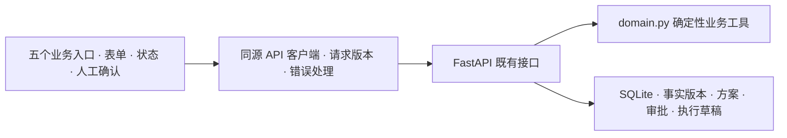
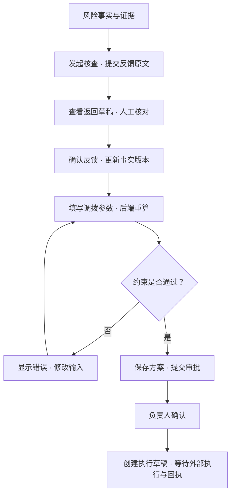

# 朱负责的前端集成说明

本说明依据当前 `backend/api.py`、`backend/store.py` 和 `backend/domain.py`，记录现有接口的消费方式及待接入能力，不新增或冻结正式契约。正式字段、错误码和 Agent 状态由魏在 `docs/agent-api-contract.md` 中维护。

## 单一业务来源

浏览器只请求同源 `/api/v1`。风险、计算结果、方案版本、审批状态和执行任务由后端返回。前端只负责格式化、筛选、输入校验及交互状态，不计算新的调拨数量、现金收益、效期结论或模型回复。空数组表示没有记录，`null` 表示未知，不与 0 混用。

局部失败展示所属资源的错误，不能改变来源或填充演示值。若保留上次成功数据，必须标为不可操作的过期结果。错误由用户显式重试，不在渲染函数中循环请求。

演示重置必须同时满足 `/health` 的 `sample_data=true` 与 `/data-center` 的 `mode=sample_replay`，且两个资源均读取成功。真实模式缺快照时，当前数据中心接口可能返回演示模式，故不能单独据此允许重置。这个前端条件仍不能替代后端真实模式禁止重置。

统一请求层统计本页面的全部在途请求，只有请求完成后才允许重置；重置期间阻止新资源读取和排队写入，结束后重新获取页面数据。联调曾在并行 GET 与重置时复现后端 `NoneType` / `InterfaceError`。页面时序控制只约束当前页面，无法隔离另一个标签页或客户端，也不能替代数据库事务、连接隔离和服务端重置锁。

## 当前实现架构

此图只包含当前实现。真实模型适配和 ERP 连接器尚未进入这条链路；[架构基线](ARCHITECTURE.md)描述后续演进方案。

## 接口对照

以下省略 `/api/v1` 前缀。`module_type` 仅为 `transfer`、`expiry-rescue`、`procurement-brake`。

| 页面/操作 | 接口 | 依赖的结果 |
| --- | --- | --- |
| 环境 | `GET /health` | `status`、`sample_data`；服务可用不等于模型可用 |
| 总览 | `GET /dashboard` | `snapshot_id`、`source_label`、金额、`operating_summary`、`teacher_baseline` |
| 风险/诊断 | `GET /risks`、`GET /risks/{id}` | `items`、`total`，详情 `risk/facts/factors/diagnosis` |
| 核查 | `POST /risks/{id}/investigations` | 核查编号；不能生成本地假编号 |
| 反馈草稿 | `POST /investigations/{id}/feedback` | 原文、`draft`、版本与确认状态 |
| 确认反馈 | `POST /feedback/{id}/confirm` | 确认状态；之后重读事实与方案 |
| 工作台 | `GET /workbenches/{module_type}?risk_id={id}` | `input/calculation/draft/proposal/snapshot_id` |
| 暂存 | `POST /workbenches/{module_type}/draft` | 草稿状态；旧计算失效 |
| 重算 | `POST /workbenches/{module_type}/calculate` | `input`、`calculation.valid/errors`、`draft` |
| 保存 | `POST /workbenches/{module_type}/save` | 后端再次校验后的 `proposal/calculation` |
| 提交/审批/执行 | `POST /proposals/{id}/submit`、`/approve`、`/execute` | 方案状态和任务编号；审批/执行传 `Idempotency-Key` |
| 回执 | `POST /execution-tasks/{id}/status` | 状态与人工填入的 `receipt_ref`；外部真实性待接入 |
| 现金模拟 | `POST /scenarios/simulate` | `selected/achieved/gap/cash_basis/bundle_validation` |
| 导入 | `POST /data-center/imports` | `status/errors/summary`；仅校验和保存导入批次 |
| 记录 | `GET /work-items`、`/proposals`、`/execution-tasks`、`/cases`、`/data-center` | 列表、快照和已确认记录 |

工作台请求体为 `{ "input": { ...当前表单字段 } }`，保留 `risk_id` 与已有上下文。模拟请求包括 `target`、`horizon_days`、`constraints`、`excluded_action_ids`。前端不得把任意自然语言约束认定为已由后端支持。

## 状态与请求生命周期

1. 输入事件立即标为待重算，清理旧方案的可提交性。
2. 同一工作台的暂存、重算、保存和提交有序执行；旧响应不得覆盖后续编辑。
3. 读取按资源请求序号及目标单据判断有效性。快速切换风险或门店后，旧响应不能作为当前结果。
4. 草稿 `calculated/saved/needs_recalculation/blocked` 和方案 `draft/pending_approval/approved/needs_replan/execution_task_created` 分别处理。
5. 按钮可用性来自后端状态及编辑状态。失败保留输入，不报告成功或自动重复写入。
6. 固定页面事件只绑定一次，动态列表采用容器代理或替换节点绑定，避免重复审批请求。

来自 API、上传文件或反馈的字符串不得直接注入 HTML、属性或 CSS。未知值与缺项明确展示；数据源标签在移动端也应可见。

## 运行过程的含义

五个入口说明：输入与快照 → 实际返回的规则/工具结果 → 证据和缺项 → 人工确认。当前不存在真实模型调用接口，故模型状态为“未接入 / 规则模式”，不能从 `calculation` 推导“模型调用成功”，也不能用动画伪造调用轨迹。

反馈接口目前使用固定因素模板与日期规则，不能理解任意反馈。必须展示原文与返回草稿供人工核对；确认记录的是核查版本，不表示后端验证了全部语义。

输入或事实改变后，旧计算及旧方案不能继续进入审批。任何 API 失败停留在所属步骤并提供重试，不凭前端状态推进到下一步。

## 魏需要补齐的集成点

| 优先级 | 缺口 | 验收条件 |
| --- | --- | --- |
| P0 | 真实模式 `/demo/reset` 无服务端禁止条件 | real 拒绝重置且数据保持不变；独立 demo 可重置 |
| P0 | 静态服务挂载整个项目根目录 | 只公开网页与资源白名单，数据库/凭证/真实文件不能下载 |
| P0 | 同连接并发访问及重置可触发 `NoneType` / `InterfaceError`，缺少版本前置条件 | 事务、连接隔离与服务端重置保护；并发冲突响应携带当前版本，跨客户端访问可重复验证 |
| P1 | 模型适配和运行契约缺失 | request/run/model ID、原文、校验结果、工具、证据和失败类型 |
| P1 | 反馈固定模板 | 真实抽取或明确的纯规则结果；未知实体和冲突约束可识别 |
| P1 | 真实快照与演示工作台边界 | real 不返回合成方案，按缺项阻断 |
| P1 | 本地身份/权限上下文 | 服务端鉴权、租户范围、审批角色和 actor 校验 |

这些缺口不能通过前端填字段、假时间线、固定金额或静默回退解决。前端按钮保护不等于服务端并发与权限保证。

## 双人协作

魏维护后端、模型、数据库和正式契约；朱维护前端、场景、测试及演示。朱的变更均在 `zmj`，不复制后端计算。集成时先确认契约，再验证诊断/反馈、调拨审批、另外三个入口、错误与并发；结论写明 commit、数据源、命令和实际输出。
