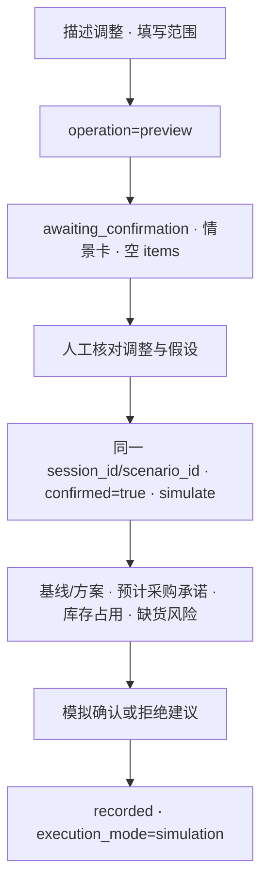

# 货不压钱 · v0.3 前端对接说明

唯一字段、单位和状态依据为[魏的 API Contract v0.3 原文](API_CONTRACT.md)。本文件记录朱的消费方式与尚待协商的口径，不替换或修改契约。[职责与交付清单](ZHU_DELIVERY.md)列明双方边界。

本轮检查的远程 `main` 为 `d27f959`，仍未实现统一 Agent 运行接口。当前前端验证依赖测试夹具；真实后端、模型与工具未完成联调。

## 当前结构

`scripts/serve_frontend.py` 只提供公开静态文件和指定 POST 转发，不计算、不造响应、不读写数据库。未配置 API 时返回 `503 API_NOT_CONFIGURED`；网络错误为 502，上游超时为 504，HTTP 错误保留上游状态与响应体。请求体不超过 2 MiB，不自动重试或跟随重定向。

`serve(root, api_base=None, host='127.0.0.1', port=8000, timeout=30.0)` 返回已绑定的 `ThreadingHTTPServer`，调用者负责运行、停止和关闭，便于使用临时端口验证。上游 URL 必须完整包含 `/api/v1`，只能来自显式 CLI/环境配置。

## 两条业务接口

| 用途 | 请求 | 前端责任 |
| --- | --- | --- |
| 统一运行 | `POST /api/v1/agent-runs` | UUID `request_id`、Agent 类型、`scope`、`params`、数据/规则版本；按响应展示步骤、结果、缺项与告警 |
| 模拟决策 | `POST /api/v1/agent-runs/{run_id}/decisions` | 关联 `item_id`、`recommendation_id`，发送 `approve/reject` 与备注；只有服务返回 `recorded`、`simulation` 才展示已记录 |

五种类型为 `slow_moving`、`store_transfer`、`near_expiry`、`procurement_brake`、`cashflow_simulation`。前端不调用旧版 `workbenches`、`feedback`、`proposals`、`execution-tasks`、导入或重置接口。

请求范围和表单选项来自合成输入清单，只说明本地有哪些输入可供选择，不代表上游已经加载该版本。实际响应的关联 ID、Agent、数据/规则版本和结构须通过校验后才采用。

## 状态与交互

| 状态 | 页面行为 |
| --- | --- |
| 请求中 | 展示等待与取消等待；返回后才展示已发生的 `steps` |
| `succeeded` | 展示结果、证据与建议 |
| `partial` | 展示已有结果，同时保留告警 |
| `no_data` | 明确空状态，保留本次范围 |
| `needs_input` | 展示缺项、问题或冲突，引导修改表单 |
| `awaiting_confirmation` | 只显示消息、情景与假设，不显示结果指标 |
| `failed`、HTTP/网络/格式错误 | 展示错误并允许显式重试，不伪造成功或自动重复写入 |

修改输入会使已有结果和待确认情景失效。请求完成时同时检查页面所属 Agent 与输入版本，旧响应不能覆盖后续编辑。每种 Agent 保留自身表单状态；取消等待不等于撤销服务端已开始的运行。来自接口的文本经过转义，不作为 HTML 注入。

情景确认与建议决策是两步不同操作，均不代表执行采购、调拨或促销。

## 金额与参考数据

金额字段以 `_fen` 结尾并传整数分，页面只做展示换算；比例用 0–1，数量保留原单位。`null` 显示未知，0 显示真实零值。前端不推算库存、效期、现金改善或模型结论。

`sample-data/generated/` 是输入包；`sample-data/reference/` 是测试参考，不能作为在线响应。浏览器夹具专门验证响应呈现与交互，标注“非真实后端 / 非模型调用”，不承担业务计算实现。

## 待魏确认并集成

| 事项 | 需明确的结果 |
| --- | --- |
| v0.3 后端地址与版本加载 | 实现两个接口，识别 `snack-demo-v1`、`snack-policy-v1`，提供真实请求与响应 |
| 库存资金计算时点 | 基线/方案指标是期初、期末还是期间均值；`inventory_capital_series` 的每日取值时点一致 |
| 日内到货顺序 | 明确到货、销售与缺货判断的顺序；PO-003 参考期望按 3 天消耗后再到货，不能视作已冻结算法 |
| 近效期预测日期 | 参考场景将未来销售窗设为 2026-10-03 至 2026-10-18，共 16 天；需确认到期日当天是否可售及 FEFO 分配 |
| 箱规适用范围 | 当前整箱约束是采购参考假设，不自动套用到调拨或拆零销售；最低采购量与取整策略需后端明确 |
| 30 天资金模拟 | 未假设后续补货时，PO-003 基线与减购方案均可能缺货；必须返回两方案的时间序列、假设与风险，不能只显示节省金额 |
| 模型与工具 | 模型结构校验、证据、失败类型与实际步骤；金额和硬约束由工具验证 |
| 并发和模拟决策 | 输入版本、重复提交、会话绑定与跨客户端冲突；`recorded` 不得被解读为真实业务执行 |

以上口径不能通过前端填固定数值解决。联调顺序遵循契约第 10 节；每次记录代码版本、数据/规则版本、请求、响应及真实测试输出。
