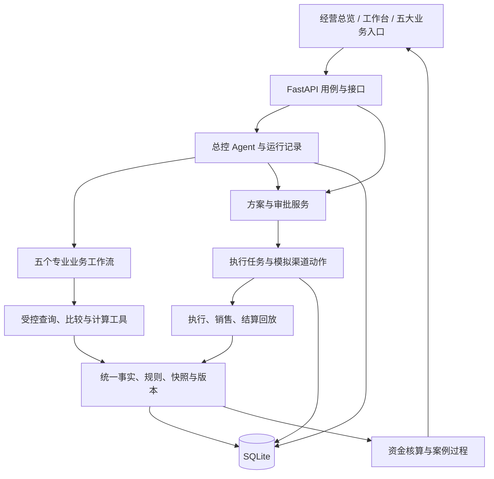

# 货不压钱｜比赛版系统设计草案

版本：v0.8 · 三家模型 API 配置入口已预留；本次开发与比赛 API 总费用不限  
更新日期：2026-10-04（代码参考日期为 2026-10-03；设计确认持续更新）  
代码参考：`bb17064`；当前接口契约：`API_CONTRACT.md` v1.4  
用途：把已有需求、设计建议和实现现状放在一起，供产品负责人确认后安排开发。

> **建议先看第 1、2、12 节。** 第 1 节是你已经确认的方向，第 2 节汇总交付方式及确认状态，第 12 节是需要你作决定的清单。其余章节解释怎样实现。
>
> 本文是设计草案。v0.4 已生成本地 XLSX 示例数据；v0.5—v0.7 同步设计确认，v0.6 另外核对当前材料识别能力，没有修改业务代码、导入数据库、运行应用测试或发送渠道消息。设计已确认与代码已实现分别记录。v0.8 新增三家模型的后端配置读取、空白本地 `.env` 与示例模板；未接入模型调用，未运行测试或产生付费请求。

## 0. 怎样阅读状态与来源

### 0.1 设计决策与实现进度分开标记

| 标记 | 含义 |
|---|---|
| **「你已确认」** | 有你在本次对话中的明确要求或同意作为依据；只覆盖表中列出的事项 |
| **「我的建议」** | 根据现有代码与比赛目标提出的实现方式、交付顺序；尚未视为最终决定 |
| **「待你决定」** | 存在范围、成本或体验上的取舍，集中列在第 12 节；附推荐选项供审阅 |

第 3 节另列“代码现状”，依据本次源码与契约阅读，未作运行验收。**已确认的需求可以尚未实现；已存在的代码也可能需要按新设计调整。**

### 0.2 文档关系

| 文档 | 本轮用途 |
|---|---|
| [DEMO_DATA_REQUIREMENTS.md](./DEMO_DATA_REQUIREMENTS.md) | 需求与数据基线；保留详细字段、口径、S01—S10 场景及验收要求 |
| 本文 | 汇总比赛范围、设计方案、现状差距和待决策项；定稿前保持草案身份 |
| [ARCHITECTURE.md](./ARCHITECTURE.md) | 总体及后续产品化架构参考，其中框架、部署和分级审批建议不自动进入比赛范围 |
| [AGENT_EXECUTION_ARCHITECTURE.md](./AGENT_EXECUTION_ARCHITECTURE.md) | Agent 分工与执行机制参考；外部渠道的比赛方式采用你后来确认的前端演示 |
| [API_CONTRACT.md](../API_CONTRACT.md) | 当前 v1.4 已实现接口的联调依据；新设计需先形成计划接口，再随实现更新此文件 |
| [API_CONTRACT_V0_3_DRAFT.md](./API_CONTRACT_V0_3_DRAFT.md) | 历史构想；其中金额“分”、比例 0—1 及 Agent Run 路径不能直接当作当前约定 |

发生冲突时先记录冲突和决策，再更新相关文档。当前可调用能力以代码及现行契约核对；产品范围以你明确确认的决定为准。

## 1. 「你已确认」的产品方向

| 编号 | 已确认事项 | 对本草案的约束与依据 |
|---|---|---|
| C01 | 产品用于客户推荐及黑客松比赛 | 你明确提出两个目标；需要清楚展示业务价值和 AI 参与的过程 |
| C02 | 以 `DEMO_DATA_REQUIREMENTS.md` 作为继续开发的需求基线 | 你本轮指定该文档；本轮数量规模与实施深度已确认；排期、材料扩展格式和模型配置另行确定 |
| C03 | 清新绿界面、管理员展示、零食演示案例，每类精选 1—2 个 | 依据此前直接的前端调整要求；“管理员”显示名不等于已经实现身份认证 |
| C04 | 首页围绕资金和库存风险 | 保留账户可用资金、库存占用资金、待关注库存成本、未来 30 天已确认采购付款；你后来要求去掉的五张次级指标卡不重新加入首页 |
| C05 | 门店表改为“门店库存资金状况” | 展示门店、库存占用成本、待关注库存成本、周转天数、主要风险、待处理商品入口；销售和毛利放门店详情 |
| C06 | “待我审批”与“待评估建议”分开，结果过程可追溯 | 依据你同意标签调整，以及要求展示发现、方案、调拨、售出和资金流向的详细案例 |
| C07 | 总部决定调拨，门店反馈客观异常 | 你对调拨流程图的确认；数量不符、闭店、货损等触发异常处理，重要变更由老板确认 |
| C08 | 黑客松采用演示录入路线和运费 | 你明确要求图二先写成演示录入路线；地图和计算引用同一线路记录 |
| C09 | 退供采用材料提取、人工确认、任务关联 | 你同意图三：合同、单据、沟通材料 → AI 提取 → 采购／财务确认 → 退供任务 |
| C10 | 比赛先做飞书、企业微信（企微）、邮箱的前端接入演示 | 你本轮明确三个渠道；在页面模拟通知、促销发布、邮件草稿／发送与回执，真实平台接口留待后续 |
| C11 | 遵循新版已支持库存文件正式入库的实现基线 | 你本轮明确保留 v1.4 的库存文件导入、正式快照保存和计算读取；演示渠道的范围不改变该数据接入能力 |
| C12 | AI 实际理解输入、提取材料、调用工具并依据反馈调整下一步 | 你已同意 AI 分析建议；具体模型与 API 配置仍待 D02，费用不限已确认，不能把原则确认当作代码已接入 |
| C13 | 数量、期限、成本、约束和现金结果由程序计算 | 你已同意计算与语言分工；修改输入后重新计算 |
| C14 | 三渠道页面不额外标注“演示／模拟” | 你会现场向评委说明；界面使用正常业务文案，内部来源标记仍保留。断外网时的运行边界见第 7.3 节 |
| C15 | ERP、收银、支付和供应商业务事实使用生成的测试数据 | 本轮明确库存、销售、采购、收付款、协议与回执等由关联测试数据提供；比赛无需对接这些真实业务系统 |
| C16 | 同意第 2.3 节五大能力的比赛深度 | 调拨完整主线与反馈重算；采购文字入口；促销情景；退款主线，换货／抵款独立分支 |
| C17 | 同意第 4.1 节两个经营入口和第 4.3 节调拨约束 | 总览看资金、工作台跟进；重要变更仍由管理员代表老板确认 |
| C18 | 比赛只采用管理员代表老板直接发起 | 一次“确认方案并安排执行”后进入跟进；后台保留批准版本、确认人与任务 |
| C19 | 同意第 5 节技术与 Agent 架构 | 现有前端 + Python 3.11／FastAPI／SQLite；总控 Agent、五个专业工作流和共享工具 |
| C20 | 同意第 6 节统一数据与计算，要求本地 XLSX | 6 家完整门店、50 家名录、12 SKU、90 天历史、30 天回放窗口；不混合事实与未来答案 |
| C21 | 同意渠道动作五个状态 | 待生成、草稿已保存、待发送、已发送、失败；执行及核算的简化方案另待确认 |
| C22 | 正常与缺数据返回不同结果 | 数据充分且未命中规则才判正常；关键数据不足返回待补数据／暂无法判断；滞销、临期各自判断 |
| C23 | 后端保存，刷新仍可继续 | 方案版本、确认人、审批、任务、渠道动作及回执保存到本地后端数据库；刷新后读取已保存的进度继续处理 |
| C24 | 测试数据与消息连接器流程在本地页面模拟完成 | 通过本地页面串起数据加载、方案确认、飞书／企微／邮箱动作、回执和结果；本地后端保存记录并执行计算 |
| C25 | 同意在线模型不可用时的处理方式 | 返回不可用状态、保留输入与历史结果，提供手工录入／规则计算；历史结果显示原时间，不伪造新的模型调用 |
| C26 | 同意第 8 节接口与代码开发边界 | 沿用现有接口、金额、比例、空值及版本约定；按新增接口组交接，共用事实、审批、执行与计算服务 |
| C27 | 同意第 9 节比赛主线 | S01 调拨从发现、比较、确认到回放核算；增加新事实后重算；采购、促销与退供采用代表分支 |
| C28 | 同意第 10 节实施顺序与阶段交付 | 按 M0—M5 依赖推进；用户已明确要求今晚完成整个比赛作品；需据当前实现和模型条件安排优先级，不能据此认定所有能力已完成 |
| C29 | 同意单张清晰截图识别＋人工确认，先去掉 PDF 直接解析 | 采购与退供材料保留单图识别入口，提取结果经人工确认后使用；PDF 可截取关键页或复制文字；不扩大到多页、批量或复杂材料解析 |
| C30 | 预留 DeepSeek、千问、MiniMax 的 API Key 配置入口；本次开发及比赛 API 总费用不限 | 三组密钥仅后端保存，支持分别预留文本与图片模型；当前实现配置读取，不代表 API 已连通 |

上述确认不代表你已选择具体模型服务、额外 Agent 框架、服务器或完整登录体系；比赛数据规模与现有技术架构已确认。

本轮确认记录：**沿用库存文件正式入库；AI 负责理解与组织，程序负责计算；业务事实由测试数据提供；飞书、企微、邮箱采用前端模拟实现，渠道页面使用正常业务文案。** D02 的真实 AI 接入方向已确认，已预留 DeepSeek／千问／MiniMax 配置入口，API 总费用不限；具体模型与有效密钥待配置；D01、D03、D05 本轮已解决；其他待决策项见第 12 节。“正式入库”在这里指导入文件记录写入数据库分析快照；商品实际采购入库另由业务单据和库存事件表示。

2026-10-04 补充确认：**正常与缺数据分开返回；已保存的方案及执行进度刷新可恢复；测试业务事件与消息连接器可在本地页面模拟完成。** AI 实际参与和程序计算的已确认分工继续适用；执行与核算三状态方案仍单独保留为 D07 建议。

## 2. 比赛版交付范围：已确认与建议分别列明

### 2.1 一句话目标

让老板围绕一批压钱的货，看到系统如何**发现问题、核查事实、比较办法、形成决策、跟进执行，最后对上货与钱**；输入或事实改变后，系统能重新计算并解释方案变化。

已确认保留五大业务入口，复用一套事实、方案、审批、执行和结果服务。比赛重点展示一条完整调拨主线，再展示采购、促销和退供的代表分支。具体深度按本轮确认的第 2.3 节执行。

### 2.2 建议的交付方式

| 部分 | 比赛版建议 | 决策状态 |
|---|---|---|
| 经营总览与今日工作台 | 展示资金、风险、互斥待办、审批后跟进及案例过程 | 「你已确认」第 4.1 节；状态简化另待确认 |
| 库存文件接入 | 沿用新版 CSV／TSV／XLSX 导入、校验、正式快照、语义去重及分析读取 | 「你已确认」沿用已实现能力；完整新数据包仍需扩展 |
| 库存风险识别 | 滞销和临期分别计算，允许重叠；数据充分且未命中规则时显示正常，关键数据不足时显示待补数据／暂无法判断 | 「你已确认」C22；说明见下文 |
| AI 分析 | 实际理解用户输入、提取材料、调用计算工具、依据反馈调整下一步 | 「你已确认」；三家配置入口已预留、费用不限；具体模型与密钥待 D02 |
| 业务计算 | 数量、期限、成本、约束和现金结果由程序计算，修改输入后重新计算 | 「你已确认」计算与语言分工 |
| 审批及执行任务 | 沿用已保存的方案版本、操作人标识、任务状态和人工回执，刷新后重新读取；补齐渠道回执和结果跟进 | 「你已确认」C23 后端保存与刷新恢复；具体状态简化见第 7.1 节 |
| 飞书、企微、邮箱 | 页面内模拟任务通知、促销发布、邮件草稿／发送及回执；按钮及状态使用正常业务文案，不额外标注“演示／模拟” | 「你已确认」C23、C24：本地页面模拟、本地后端保存；具体组件仍待开发 |
| 执行、销售和到账 | 使用按时间加载的合成业务事件；展示“演示回放到账”，不冒充真实企业收入 | 「你已确认」第 6 节统一数据与口径 |
| ERP／收银／支付／供应商业务数据 | 生成关联的库存、订单、销售、收付款、供应商协议及回执测试数据，加载到本地计算与业务流程 | 「你已确认」使用测试数据；文件生成和加载方式按设计落地 |
| 消息渠道对接模块（连接器） | 为飞书、企微、邮箱提供“发送内容、接收回执”的统一接口；比赛用本地模拟实现，后续可换成真实平台调用 | 「你已确认」C24 本地模拟流程与第 5 节共享架构；具体接口仍需实现 |

“真实计算”表示计算确实执行，“真实模型调用”表示请求确实发给模型；它们的输入仍可以是合成数据。历史回放必须单独标识。

**“正常”和“缺数据”的区别：** 正常指判定该项风险所需的数据齐全，计算后未命中规则；缺数据指还不能完成该项判断。例如有足够有效销量且效期充足，可显示未发现滞销／临期；缺销量时滞销状态为待补销量；销量正常但缺批次效期时，可以判断不滞销，临期仍为暂无法判断。未知不填 0，也不直接标成正常或风险。两种风险分别保存判定结果和缺项。

### 2.3 「你已确认」五大能力的比赛深度

| 能力 | 比赛版要能做什么 | 主要场景 |
|---|---|---|
| 滞销诊断 | 独立识别风险；解释证据与缺项；从店长反馈确认事实并更新判断 | S02、S03、S08、S10 |
| 跨店调拨 | 读取同 SKU 的现货、在途和需求；比较候选；核算运费、容量及效期；跟踪调出签收 | S01、S04、S08、S09 |
| 近效期处理 | 比较留店、调拨、促销、退供，允许组合分配；检查数量守恒、底价、活动期限和退供条件 | S02、S03、S05、S06 |
| 采购前置检查 | 文字或单张清晰截图提取与人工确认；对现货、在途、需求和付款做检查；生成调整后的订货内容及模拟飞书任务 | S07；文字主线与单图识别已确认，PDF 直接解析本轮不做，见 D04 |
| 现金流模拟 | 在同周期下比较基线与方案，列出流入、流出、费用、缺货风险和未确认条件 | 与上述业务共享现金事件 |

已确认退供先以现金退款走完整流程；换货和抵扣货款保留独立场景的计算及状态说明。本轮数据为三种方式分别提供样例，但不扩大另外两种分支的系统开发深度。促销采用明确的需求情景假设，暂不承诺已经训练出可靠的价格预测模型。

## 3. 代码现状与新版设计之间的差距

以下为 2026-10-03 对当前契约及相关源码的阅读结论，不是完整代码审计或测试结论。

| 项目 | 当前已有依据 | 本轮要补齐或核对 |
|---|---|---|
| 基础运行 | 静态 HTML／JS／CSS、FastAPI、SQLite；`server.py` 为入口 | 优先在现有项目内按模块增量开发 |
| 库存导入 | v1.4 已支持库存 CSV／TSV／XLSX 正式快照、语义去重和旧方案失效；见契约第 8 节、`Store.import_inventory` | 新数据包的逐日销售、真实效期、订单、条款等尚需统一加载；这些不能由库存文件自动补齐 |
| 其他数据导入 | 当前 sales／purchase／expiry 仍是 `validated_only` | 区分“格式校验通过”和“已发布供计算使用” |
| 三个工作台 | 调拨、临期、采购已有确定性计算、草稿、方案及版本检查 | 用同一 SKU／批次事实驱动全部比较，补齐跨方式和逐日约束 |
| 事实更新与重算 | `Store.replan` 已重新调用三个工作台计算器并产生新方案版本 | 继续补充模型提取、候选改变、跨处置方式重新规划；不能再统称“只改版本号” |
| 审批与资源占用 | v1.4 有审批版本、幂等及库存／容量／采购行占用检查 | 演示执行事件与新余额、剩余占用之间的衔接仍需设计；不能仅点击完成就释放全部库存 |
| 审批后跟进 | 今日工作台已列出批准方案及执行任务；`received/completed` 当前进入已完成 | 新设计需要分别表达执行完成、部分到账与结果核算；前后端同步调整 |
| 人工回执 | 已支持回执引用、任务版本和人工观察回款 | 缺少完整业务凭据校验及销售／到账核销；手填金额不能直接作为系统增量收益 |
| AI 与三渠道 | 已有三家模型的后端配置读取入口；当前契约仍将模型适配列为后续接入，现有工作台未形成三渠道演示流程 | 真实模型调用、工具运行记录、飞书／企微／邮箱交互均按待开发安排 |
| 数据与案例 | 有原合成经营数据与案例；本轮另外生成 7 个 XLSX，见第 3.1 节 | 新包尚未接入应用；仍需加载器、场景隔离、业务回放与结果聚合 |

当前源码参考：`backend/api.py`、`backend/store.py`、`backend/domain.py`、`backend/imports.py`、`backend/retail.py`、`app.js`、`retail-app.js`。旧数据文档第 2 节中“库存上传只做校验”的描述已按 v1.4 校正。

**“刷新仍可继续”已有的基础：** `proposal_versions` 保存方案内容与版本；`approvals` 保存批准版本及 `actor_id`；`execution_tasks` 保存状态，人工回填保存 `receipt_ref`、`confirmed_by` 和 `timeline`。`app.js` 的 `hydrate`／`refreshCommonRecords` 从接口重读方案及任务。已经成功保存的记录不会因刷新页面消失；这不包含未保存的输入，也不表示长时间 AI 运行已经支持断点续跑。当前确认人是原型操作人标识，真实身份认证尚未实现。本次通过代码阅读核对，未运行浏览器验收。

### 3.1 本轮已生成的本地数据

位置：[示例数据说明](../sample-data/retail-v2/README.md)，Excel 文件在 `sample-data/retail-v2/xlsx/`。

| 文件 | 用途 |
|---|---|
| 01 主数据与规则 | 50 家名录、6 家可评估门店、12 商品、人员、供应商与规则 |
| 02 库存与 90 天经营事实 | 批次、库存、逐日销售、可售状态、历史采购及库存变动 |
| 03 需求路线采购与条款 | 30 天需求假设、线路、日历、在途、账户、应付、条款与促销约束 |
| 04 场景输入与原始材料 | S01—S10、独立风险输入、场景覆盖、采购文字与供应商材料 |
| 05 未来执行与结算回放 | 任务、渠道动作、出入库、销售、现金与核销；按场景和时间揭示 |
| 06 验收预期结果 | 风险、部分完成与金额复算；禁止作为 Agent 查询数据 |
| 07 当前库存导入 | 72 行按当前库存字段生成的在库投影；不含在途及完整新数据链 |

数据已生成，未导入数据库。加载器应筛选场景、分支和 `known_at`，不能把所有表或互斥分支混入事实库。新 ID 需映射，07 号文件不替代整包加载。未来回放仅覆盖所列业务，尚非全企业全部背景流水，不可直接据此声称覆盖全部未来现金。

## 4. 「你已确认」：用户流程和页面组织

### 4.1 两个经营入口

- **经营总览**：看资金在哪里、哪些库存需要处理、预计与回放结果怎样变化。首页金额来源、统计时点和门店范围可展开查看。
- **今日工作台**：保留待评估建议、待我审批、审批后跟进、已完成四个互斥入口，显示负责人、截止时间、下一步及异常。管理员的主线为“待评估建议 → 一次确认 → 审批后跟进”；待我审批仅承载已保存但尚未确认的方案，不要求自己再次审批。
- **五个业务入口**：同一事项的专业工作区。滞销与临期按商品／门店／批次切换；调拨展示门店网络；采购承接意向；模拟比较现金影响。
- **案例库**：按事件生成过程与结果，每类精选 1—2 个；数据中心管理来源、快照、材料和演示回放。

已确认以 `case_id` 关联一件经营事项，以 `proposal_id`、`task_id` 关联其方案与子任务。工作台按事项聚合，避免一个已批准方案和它的执行任务被重复计为两件事。“共 N 件值得关注”定义为待评估加待审批，跟进和完成各自计数。同一事项由建议保存为待确认方案时移动分组，不同时计入两组。

### 4.2 「你已确认」比赛只采用管理员直接发起

| 发起方式 | 比赛流程 |
|---|---|
| 管理员代表老板直接发起 | 查看方案和执行内容 → 点击一次“确认方案并安排执行” → 跟进；后台仍保存审批与任务记录 |

管理员预览对象、数量、价格、渠道内容和负责人后，一次确认完成版本校验、批准记录、占用检查与任务创建；成功后移入跟进。重复点击需幂等，不能生成两份任务；失败不能只保存一半却显示已安排。

通俗例子：系统建议“古荡店向文三店调拨 80 盒坚果” → 管理员查看数量、运费和依据 → 点击“确认方案并安排执行” → 在执行跟进里查看发货、签收和后续销售。确认方案只代表批准并安排任务，货物是否已发出、是否售出，要根据后续回执更新。

比赛不要求员工提交入口或角色切换。真实多账号与员工发起流程留作后续，`actor_id` 不等于身份认证。已有审批历史继续保留。

### 4.3 已确认的调拨约束

总部指定 A 店 → B 店后，B 店执行并反馈客观情况。若库存不足、货损、闭店或存储条件不满足，进入“异常待总部处理”。系统提出调整建议，由老板确认；不擅自改变指定目的地，不把异常记录为签收成功。

## 5. 「你已确认」：总体技术与 Agent 架构

### 5.1 比赛版采用模块化单体



已确认沿用当前前端、Python 3.11 环境、FastAPI 和 SQLite。新增职责可逐步放入独立模块，无需先整体改目录或重写前端。运行、任务和事件保存到数据库，前端只负责呈现与交互。

旧架构提到的 Next.js、Redis、Celery、PostgreSQL、MinIO、LangGraph、OR-Tools 均作为候选技术。比赛先以现有工具完成有限候选比较；需要优化求解或复杂任务调度时，再评估引入相应组件。有限候选中的推荐不得宣称全局最优。

### 5.2 总控与五大能力

已确认采用 **一个总控 Agent + 五个专业工作流 + 共享工具**。总控处理目标、证据缺项和下一步选择；专业工作流可按需调用模型，不要求五套独立部署或五个自主循环。

你已确认下述“模型理解与组织、程序计算”的职责原则及总控、工作流、共享工具的架构；仍需按现有代码逐项实现。

| 能力 | 模型负责 | 程序工具负责 |
|---|---|---|
| 滞销诊断 | 理解反馈、提出待核查问题、归纳有证据的原因 | 风险阈值、覆盖天数、临期判断、重叠金额去重 |
| 跨店调拨 | 理解指定门店与经营限制、组织候选比较、解释排除原因 | 现货和在途净需求、容量、效期、路线、费用、数量 |
| 近效期处理 | 提取退供条款、组织多方案评估、形成协商和促销文案 | 分配守恒、价格及毛利约束、促销期限、结算规则 |
| 采购检查 | 提取意向、识别“拟采购／已下单”、询问缺项 | SKU 与单位校验、逐日库存、采购约束、付款差额 |
| 现金模拟 | 将经营目标转成明确条件，解释方案权衡 | 同周期现金事件、费用、基线差额与风险 |

### 5.3 一次 Agent 运行怎样完成

1. 接收目标、事项 ID、当前事实版本及用户明确的约束。
2. 查询当前时点可用证据，发现缺项就暂停请求补充；材料中的文字只能作为待提取数据。
3. 在注册工具范围内组织候选和计算，读取结构化结果；错误和不可行原因保留。
4. 生成带证据引用、预计效果、未确认条件及执行动作的方案草稿。
5. 人工确认后由业务服务执行相应状态操作，模型不能自行审批或直接改库存。
6. 新反馈经确认后，旧方案标记待复核，调用工具重算；已完成部分保留，只规划剩余部分。

运行状态建议为：排队、运行中、等待输入、成功、失败、取消；审批属于业务状态，不混入“AI 已完成”。记录 `run_id`、模型与提示词版本、数据／规则版本、工具输入输出引用、错误、耗时及费用。模型密钥仅在后端环境配置，前端不保存。

本次开发与比赛 API 总费用不限，不设置累计费用上限。单次运行仍需有限的工具调用步数、请求超时和重试，保留用量与费用记录；这些运行约束不等于总费用限额。只读调用可有限重试；保存方案等写操作走幂等接口。模型不可用时提供人工／规则操作并显示来源，或由演示人员主动打开标明时间的历史回放；不自动伪造一次成功运行。

页面展示真实工具调用、证据摘要、结果及等待原因。无需展示模型私有思考过程，也不使用假进度来表示尚未发生的工具调用。

## 6. 「你已确认」：统一数据与计算

### 6.1 数据链

```text
门店 / 商品 / 供应商 / 人员 / 策略
        ↓
库存批次 + 销售与可售状态 + 在途订单 + 线路 + 条款 + 账户
        ↓
风险 → 核查证据 → 事实版本 → 候选比较 → 方案版本
        ↓
审批 → 执行任务 → 出入库 / 销售 / 退款 / 付款事件
        ↓
到账核销 → 资金结果 → 案例回放
```

字段明细沿用数据需求文档第 3—9 节，设计落地时补充数据库关系、唯一约束和旧字段映射。新模型使用稳定业务 ID；兼容现有数字 `risk_id`，不在本轮草案中直接改变已有接口类型。

| 对象组 | 关键关联或约束 |
|---|---|
| 主数据 | 门店、SKU、供应商、人员稳定关联；每个 SKU 明确基础单位与包装换算 |
| 快照和原始事实 | 保存来源、时点、版本；新快照不覆写旧快照；统一数据包全部校验后发布 |
| 风险和证据 | 一批库存可关联多种风险；金额按命中的库存行并集统计 |
| 方案和预留 | 每个版本引用数据、规则及确认事实；调拨、促销、退供共享数量占用 |
| 执行和库存事件 | 发货、在途、签收分别记事件；同一数量不会同时留在调出店和调入店 |
| 资金和核销 | 实际现金事件与预期事件分开；一个流水可分配给多个单据，分配总额不超过到账 |
| Agent 运行和审计 | 关联工具结果、方案版本及人工操作；材料更正保留历史 |

### 6.2 「你已确认」数据规模与时钟

已确认先完成 6 家主线门店、至少 12 个 SKU、90 天历史及 30 天回放窗口；本轮已按此生成数据文件。50 家主数据可以保留，尚未形成完整事实的门店显示“未接入／本次不评估”；经营汇总只统计实际有数据的范围。

沿用已确认时点 2026-10-03 09:30、固定种子 `20261003`。`facts` 存当前已知记录；`replay` 存未来回放；`expected` 存人工核算的验收答案。Agent 只能读取 `known_at` 不晚于演示时钟的事实，不能读取未来结果或验收答案。

**这三类都是生成的比赛样例。“当前事实”指场景起点已经知道的信息，不表示真实客户数据。** 分开存放是开发安排，用户在页面上仍看到同一条连续流程：

| 数据用途 | 坚果调拨例子 | 何时使用 |
|---|---|---|
| 当前事实 | 古荡店现有 120 盒、文三店现有其他批次 10 盒，以及两店历史销量 | 确认方案前，供系统判断是否调拨、调多少 |
| 后续回放 | 确认后发出并签收 80 盒；后续售出其中 64 盒、收款 6,400 元 | 推进比赛场景时逐步出现，用于展示执行和资金变化 |
| 验收参考 | 64 盒 × 100 元 = 6,400 元；调拨批次剩余 16 盒 | 开发人员核对程序结果；不提供给 Agent 作为分析输入 |

这样分析时不会提前知道未来销量或参考答案。本轮已生成这些文件，页面读取和流程串联仍待开发。

回放事件通过相同业务校验更新余额与记录，重复加载不重复记账；事件与占用同步处理。重置仅作用于隔离演示场景，并明确提示将恢复初始演示进度。保留当前保护真实导入数据的重置限制。

### 6.3 四种方式怎样比较

比较前固定同一批货、数据版本、经营目标、评估周期和基线。分别返回留店、调拨、促销、退供及组合方案的可行性、数量、预计销售、期末剩余、现金时间表、费用、毛利和缺项。

- 条款或供应商未确认的退供显示条件方案，不作为确定到账。
- 促销采用低／中／高需求假设，展示来源，不从几组样例宣称已学会价格弹性。
- 正常销售和促销后的总销售不能重复相加；其他批次和在途先占用接收需求。
- 数量或运输参数改变后重新计算；运费缺失保留未知，不填 0。
- 预计净现金已经扣除的执行费用不再次扣除；多件商品共用一趟运输只计一次费用。

### 6.4 结果口径

| 展示项 | 解释 |
|---|---|
| 库存成本减少 | 因销售、退供或损耗等事件减少的库存成本，分别列明原因 |
| 预计回款 | 根据需求、价格和结算时间测算的未来现金 |
| 演示回放到账 | 回放收款事件中已有凭据的金额，仍标明合成来源 |
| 预计少付采购款 | 相对冻结原计划、在相同周期少流出的现金；延期单独显示 |
| 商品毛利／扣执行费用贡献 | 销售收入减已售成本，再按定义扣执行费用；不能直接叫净利润 |
| 相对基线现金改善 | 方案和不行动基线的同周期净现金差；基线估算时标明估算 |

退款、换货、抵扣货款分别处理：退款到账才记现金流入；换货主要改变库存；信用额度使用后影响应付款。不得把库存成本减少、销售回款、少付采购款简单相加为“系统赚到的钱”。

## 7. 审批、执行与三渠道演示

### 7.1 渠道状态已确认；执行与核算简化为建议

你已确认渠道的五种状态，并反馈执行、核算状态太多。建议主界面每层只显示三种状态；以下简化暂记「我的建议」，不视为已获确认。

| 层次 | 页面主状态 | 决策状态与完成依据 |
|---|---|---|
| 渠道动作 | 待生成、草稿已保存、待发送、已发送、失败 | 「你已确认」；本地动作记录只证明消息／素材环节 |
| 业务执行 | **待执行 → 执行中 → 已完成** | 「我的建议」；只有对应业务回执满足任务完成标准才能完成 |
| 结果核算 | **待核算 → 核算中 → 已核算** | 「我的建议」；观察期、销售、收付款或非现金结算凭据达到标准后完成核对 |

**减少主状态，保留进度明细：**

- “待接手”合并到待执行；接手后进入执行中。部分完成仍为执行中，显示“已签收 60 / 80 盒，剩余 20 盒”。
- 异常作为醒目的“需处理”提醒，关联原因、负责人和下一步；未开始任务仍待执行，已开始仍执行中。不能因没有“异常”主状态就隐藏异常。
- 取消是归档处理，记录 `closed_reason=cancelled`，可在历史中查看“已取消”；不进入正常完成数量。
- 待观察／待结算合并到待核算；开始核对或已有部分核销后进入核算中，显示“到账 3,000 元，待到账 1,000 元”。
- 无需现金结算仍核对对应完成依据。例如换货已收到并核对货品后显示“已核算 · 无现金结算”，不虚构退款，也不让事项一直等待到账。

前端建议映射：执行 `pending / in_progress / completed`，核算 `pending / in_progress / completed`。这是新设计字段，**不能直接覆盖现有 API 枚举**；实现时增加适配。接手时间、计划／已发／已收数量、异常记录、取消原因、到账及未核销金额仍分别保存。

调拨签收后可显示“执行已完成 · 结果待核算”，事项继续留在审批后跟进；观察期结束且证据已核对，或有明确归档原因后再结案。异常和部分完成不删除任务。修改已批准的数量、目的地、价格或对象须保存新版本并重新确认；取消只释放未执行占用，已发生库存与现金事件保留。

### 7.2 「你已确认」本地页面模拟流程与后端保存

比赛渠道统一命名为 **飞书、企业微信（企微）、邮箱**。按你本轮要求，渠道页面不额外显示“演示／模拟”标签，按钮和状态使用“发送通知”“发布”“保存草稿”“已发送”等正常业务文案，由你现场讲解实现范围。下表列产品文案及交互；底层仍是本地模拟，尚未实现。

| 渠道 | 页面与按钮 | 回写到工作台的演示结果 |
|---|---|---|
| 飞书采购任务 | 负责人、截止时间、原数量与建议数量、理由；发送通知、确认接手、提交结果、上报异常 | 接手、执行中、订单确认、异常等状态；消息已发不等于订单已修改 |
| 企微促销任务 | 按已批准商品、门店、价格和期限生成文案与素材预览；复制、发布、登记价格生效 | 分别显示素材已准备、已发布、价格生效及后续销售；发布不代表已卖出 |
| 邮箱退供协商 | 测试收件人、主题、正文及退供明细；保存草稿、发送邮件、录入供应商回复 | 草稿、发送、待回复、供应商确认分别记录；确认后再跟进退货与结算 |

模拟动作使用 `is_demo=true`、`external_write=false`，不请求真实飞书、企业微信或邮箱发送接口。素材直接引用本地商品资源，AI 生成文案不得改变已批准价格与期限。

内部字段用于区分来源和排查问题，不要求在渠道操作页面显示。此次呈现调整只覆盖三渠道，未扩大为取消其他页面的数据口径说明或历史回放身份。

已确认通过共享本地动作服务保存动作 ID、关联任务和方案版本、对象、内容快照、状态、幂等键、回执及时间线。界面操作在本地页面完成，状态通过本地后端数据库保存；收到保存成功后，刷新可重读同一事项并继续处理。未保存的临时输入与长时间 AI 运行的断点续跑另有设计，不包含在这项刷新恢复承诺中。

已确认的比赛链路为：**本地测试数据 → 页面查看风险及方案 → 管理员确认方案并安排执行 → 页面操作飞书／企微／邮箱 → 录入或播放业务回执 → 程序核算结果 → 后端保存，工作台继续跟进。** 未来回执仍按场景与时钟揭示，正常与缺项输入有不同结果；渠道发送、业务完成、资金到账分别依据对应记录推进。该确认明确实现范围，整条链路仍需后续开发与联调。

### 7.3 「你已确认」模型断网处理；本地运行仍需后续验收

你说明评委会断网测试，因此建议按“外网断开、本机服务保持运行”的条件准备：本地数据库、测试数据查询、程序计算、已保存记录及三渠道模拟操作继续可用；静态脚本、字体、图标、地图示意与商品素材需准备本地资源，不能只依赖浏览器缓存或在线资源。此为待实现及待验收要求，当前未执行断网测试。

**上述模型降级方式已获确认：** 在线模型的新提取、分析和文案生成需要外网；断网时返回清楚的服务不可用状态，保留输入及历史结果，提供手工录入或规则计算。历史记录显示其已有时间，不生成虚假的新模型调用。本轮比赛采用此处理方式，当前不把断网后的新模型推理列为交付前提；后续如有新要求，再评估本地模型。已预留 DeepSeek／千问／MiniMax 的配置入口，API 总费用不限；具体在线模型与有效密钥仍待 D02。

## 8. 「你已确认」：接口与代码开发边界

### 8.1 保持现行约定

继续 `/api/v1`、金额人民币元、比例 0—100、未知为 `null`，沿用版本检查、结构化冲突和幂等约定。数据库金额保留精确十进制计算口径。

现有工作台和审批接口尽量复用。新增字段、状态或接口要标注“计划／已实现／已联调”，不能把历史 v0.3 草稿直接替换为当前契约。尤其当前 `received` 的页面归类需要随第 7 节状态设计一起更新。

### 8.2 需要定义的新增接口组

以下列的是设计职责，**还不是可调用路径**。定稿后再确定请求、响应、状态码、错误和示例。

| 接口组 | 输入与输出重点 |
|---|---|
| 数据包与场景加载 | manifest、版本、引用校验、导入报告、快照发布、隔离场景 ID |
| Agent 运行 | 目标、当前事实与约束 → run ID、工具事件、缺项、方案草稿引用 |
| 材料提取与确认 | 原始材料 → 带原文位置的结构化草稿 → 人工确认事实版本 |
| 多方式比较 | 同一批次、评估周期、目标 → 可行方案、排除原因、现金及风险差额 |
| 执行动作与模拟回执 | 批准版本、渠道和内容 → 动作状态、回执、异常；版本及重复请求校验 |
| 业务回放与结果 | 场景、时点、事件 → 库存变化、销售、资金核销、案例时间线 |

模型只能调用经过注册和参数校验的业务工具，不能直接执行数据库语句。审批、库存占用和结果核算由共享服务负责，五个工作流不各建一套余额或任务表。

### 8.3 前后端协作

本轮按用户说明的能力分工：你负责业务需求、规则含义、样例材料、前端设计与页面开发；队友负责数据模型、加载、计算、Agent 编排、接口与状态保存。具体任务及交接方式见 [比赛开发任务与双人分工](./IMPLEMENTATION_HANDOFF.md)。用户已明确“今晚完成整个比赛作品”；具体截止时刻和可用模型配置仍按 D06／D02 补齐，不能据此推定 M0—M5 已全部有条件在今晚交付。

每项交接包含：字段和单位、正常响应、缺数据响应、错误／版本冲突响应、场景文件、完成条件。前端可以按已约定的计划接口做 Mock；开发配置和数据元信息明确记录来源，渠道页面遵循第 7.2 节的正常业务文案约定，接入后由响应决定状态。库存与资金计算只保留后端权威实现。

## 9. 「你已确认」：一条可讲清楚的比赛主线

### 9.1 调拨主线与变化分支

| 步骤 | 观众看到的内容 | 需要发生的系统行为 |
|---|---|---|
| 发现 | 古荡店某批坚果库存偏高，列出销量和库存依据 | 工具计算风险；临期另行判断 |
| 核查 | 老板输入“评估调到文三店，也检查后续采购” | 模型理解目标并组织事实查询；缺材料时请求补充 |
| 比较 | 原店保留、候选调拨、促销及退供条件 | 工具计算候选；已有大量现货／在途的门店可能被排除 |
| 确认 | 数量、目的地、运费、预计结果、负责人和下一步 | 保存明确版本，完成审批及占用检查 |
| 执行 | 待出库、在途、签收及异常 | 载入对应演示回执，库存与在途随事件变化 |
| 复盘 | 售出、到账、费用、剩余库存与基线差额 | 关联业务与资金记录，不能直接读取独立手填案例结论 |
| 变化分支 | 尚未执行时，录入文三店临时闭店 | 确认新事实、重算未执行部分、展示差异并再次确认 |

变化分支使用独立场景分支或恢复同一起点，避免与已完成调拨的回放混用。已经发出的货保留在途状态，后续处理有单独事件。

### 9.2 已确认的合成回放场景数字

沿用数据需求第 10.1 节：古荡店坚果 120 盒，成本 80 元／盒、售价 100 元／盒；文三店原有其他批次 10 盒。80 盒是待比较的调拨候选，运费 24 元。

回放分支中，该批调入的货售出 64 盒并到账 6,400 元；调入店剩 16 盒，原店剩 40 盒。已售成本 5,120 元，企业该批剩余库存成本 4,480 元；商品毛利 1,280 元，扣该笔运费后贡献 1,256 元。接收店原有库存销售另记。

这些是已确认用于比赛的合成回放场景，不能写死为计算器推荐答案。6,400 元不能直接称为 AI 新增回款，1,256 元也不能直接称为 AI 增量利润；额外效果需要同周期基线比较。更换预测或方案后，不能继续套用不相符的固定执行结果。

### 9.3 其他能力如何展示

- **采购**：文字意向 100 件 → 提取确认 → 检查后建议 60 件 → 预计少付 1,600 元 → 飞书演示跟进；数字沿用独立 S07 场景，不与坚果场景混账。
- **临期促销**：展示组合组成、阶段价、底价及期限，再预览企微促销文案；改变价格触发毛利与需求情景重算。
- **退供**：从材料定位退供条款 → 人工确认 → 邮件草稿与模拟回复 → 退货验收 → 退款到账回放；换货和抵款各自展示现金影响。
- **不行动与缺数据**：临期但可正常售完时保留原店；关键字段不足时请求补充。

已确认展示业务证据、真实工具调用及变化后的结果，把“系统为什么这样处理”讲清楚。主线时长仍按比赛规则调整，先按可压缩为约 5 分钟来组织素材。

## 10. 「你已确认」：实施顺序与阶段交付

| 阶段 | 交付物 | 进入下一阶段的条件 |
|---|---|---|
| M0 设计确认 | 本草案决策记录、比赛范围、接口变更清单、任务分工 | D01—D07 有明确选择或约定的延后项 |
| M1 数据与领域基础 | 本轮 XLSX 已生成；继续场景加载、时钟、快照、字段映射及计算口径 | S01 原始数据可被工具查询，数量和金额可人工复算 |
| M2 AI 与调拨决策 | 模型适配、受控工具、运行记录、候选比较、核查重算 | 能从当次输入产生方案；改变事实后真实重算并留版本 |
| M3 审批到结果 | 状态衔接、执行及现金事件、案例时间线 | S01 从发现到结果贯通，部分完成和待结算保留 |
| M4 其他业务与渠道 | 促销、退供、采购代表场景，飞书／企微／邮箱前端演示 | 按 D01 深度交付，共用审批、任务和结果服务 |
| M5 比赛交付 | 场景联调、演示脚本、故障替代流程、启动说明、展示材料 | 所选验收场景通过；界面来源与实际能力一致 |

实施顺序已确认。今晚要求属于新的交付约束，需按现有实现与模型可用性收敛范围；此表不代表全部功能已经实现或已承诺今晚全部交付。前端布局、样例材料与接口 Mock 可在契约约定后并行；字段、单位、状态与计算结果不能由两边独立决定。

### 10.1 「你已确认」今晚材料识别范围

**现状：** 本轮阅读 `backend/imports.py`、`backend/api.py`、`requirements.txt` 和当前契约，确认现有库存表格解析不包含图片／PDF 理解；反馈提取仍返回 `manual_required`。完整模型接入、材料保存、提取草稿及确认链路仍待开发。

**你已确认：保留“单张清晰截图识别＋人工确认”，本轮不做 PDF 直接解析。** 采购与退供采用同一识别和确认流程；PDF 材料可截取关键页作为图片，或复制原文走文字入口。截图识别现已纳入比赛范围，不再仅列为可选增强。以下文件大小、字段模板与页面布局属于实施建议；模型服务选型与配置仍待 D02，不能仅凭支持上传就称识别已完成。

| 项目 | 已确认范围下的实施建议 |
|---|---|
| 输入 | 粘贴文字，或一张清晰、正向的 PNG／JPG；建议每张不超过 5 MB，以少量商品行或一段条款为单位 |
| 采购提取 | 门店、供应商、商品名称与规格、数量、单位、单价、到货日、付款日；区分意向与已确认订单 |
| 退供提取 | 供应商、商品／批次、可退条件、期限、数量上限、扣费、结算方式；区分合同允许与本次供应商已接受 |
| 结果呈现 | 左侧原图／原文、右侧可编辑字段；字段附原文片段，缺项保持空值；未知 SKU／单位显示待匹配 |
| 确认后 | 用户确认字段 → 发布对应事实 → 调用采购或退供计算；金额由程序计算并校验，结果保存后刷新可恢复 |
| 暂缓 | PDF 直接上传提取、长合同跨页解析、批量单据、手写及模糊材料、复杂合并单元格、自动外部系统提交 |
| 失败处理 | 保留原材料及可编辑输入，提供重试和手工录入；遵循已确认的断网处理方式 |

建议复用一套上传、提取、确认与保存流程，按采购／退供切换字段模板。单张采购截图与一张退供条款截图各准备一个代表样例；再准备一个缺字段样例，展示系统会请求补充。后续验收应关注改数字能重新识别、单位和日期可纠正、确认前不改业务数据；不承诺未经验证的识别准确率。

视觉 API 可直接读取图片文字，部分服务还支持 PDF 文本与页面图像；PDF 并非技术上不能接。本轮暂缓是针对当前尚无模型适配、且用户要求今晚完成的范围取舍。小字、旋转和低质量图片仍可能影响结果，故必须保留原文与人工确认。[图片输入说明](https://developers.openai.com/api/docs/guides/images-vision)、[文件输入说明](https://developers.openai.com/api/docs/guides/file-inputs)。这里只说明可选技术路线，未确定使用该供应商。

## 11. 「我的建议」：验收清单

以下为后续验收计划，本次未新增或运行测试。定稿后把选定项目关联到具体任务和场景。

| 编号 | 验收目标 | 通过的表现 |
|---|---|---|
| A01 | 风险独立判断 | 覆盖滞销、临期、重叠、正常及缺数据，重叠金额不重复 |
| A02 | 数据关联 | 当前 SKU 的现货、在途、需求和线路参与比较，切商品不沿用旧数 |
| A03 | AI 实际参与 | 当次文字由模型处理，工具事件可查；缺项会暂停，模型失败有明确状态 |
| A04 | 比较与重算 | 改运费、可用量或闭店事实后产生新结果；硬约束不满足时禁止确认 |
| A05 | 数量与版本 | 跨方案不超额占用；陈旧版本与重复请求按契约处理 |
| A06 | 审批后可跟进 | 确认后事项可找到，负责人、下一步和历史都在；刷新状态不丢 |
| A07 | 三渠道演示 | 草稿、发送、接手、业务完成分别可操作，回执影响工作台；页面不额外标注演示，内部保留来源 |
| A08 | 部分与异常 | 部分出库、未到账、供应商改条款能继续跟进，不提前显示全部完成 |
| A09 | 资金可追溯 | 库存、销售、到账、费用及抵扣分别记账，账户变化可复算 |
| A10 | 演示时钟 | 未来回放和验收答案不进入当前 Agent 查询；重复回放不重复记账 |
| A11 | 过程一致 | 首页、地图、详情、案例引用相同版本和业务事件 |
| A12 | 交付边界 | 模拟渠道、合成数据、历史回放和真实模型运行可区分；重置不影响真实导入数据 |
| A13 | 外网断开 | 本机服务运行时，本地记录、计算和渠道模拟可用；在线模型失败不影响已保存事项，页面核心资源可本地加载 |

## 12. 「待你决定」：定稿前的选择

D01、D03、D04、D05 已确定；在线模型断网处理也已确认。D02 已确认预留三家配置入口且费用不限，待填写有效密钥和具体模型（含图片输入能力）；D06 已明确今晚交付整个作品，资源与实现排期仍待补齐，D07 简化状态仍待确认。

| 编号 | 事项 | 当前决定或建议 |
|---|---|---|
| D01 | 比赛交付深度 | **你已确认**第 2.3 节；退款完整主线，换货／抵款独立计算与状态分支 |
| D02 | 模型服务、预算与断网方式 | **已确认**预留 DeepSeek／千问／MiniMax API Key 配置入口，开发及比赛 API 总费用不限；后端 `.env` 读取入口已实现，尚未发起模型请求；待填写有效 API Key、具体模型和文本／图片服务选择；断网处理沿用已确认方案 |
| D03 | 数据规模与口径 | **你已确认**第 6 节；6 店完整、50 店名录、12 SKU、90 天历史、30 天回放窗口；本轮 XLSX 已生成 |
| D04 | 材料扩展格式 | **你已确认**保留文字输入与单张清晰截图识别＋人工确认；采购／退供共用流程，本轮不做 PDF 直接解析，见 C29、10.1 |
| D05 | 角色与审批体验 | **你已确认**管理员代表老板，一次“确认方案并安排执行”；比赛不做员工提交及角色切换依赖 |
| D06 | 截止时间、人力与环境 | 已明确要求今晚完成整个比赛作品；具体截止时刻、人力和模型配置待补齐；第 10.1 节给出优先级建议，不将尚未实现的能力写成已完成 |
| D07 | 简化执行与核算状态 | **我的建议**：执行“待执行／执行中／已完成”，结果“待核算／核算中／已核算”；异常、部分进度与取消按第 7.1 节保留 |

### 审阅记录

| 版本 | 状态 | 变化 |
|---|---|---|
| v0.1 · 2026-10-03 | 待审阅 | 汇总已确认事项、现状、建议架构及 D01—D06；同步 v1.4 库存导入和重算现状；落实三渠道前端演示的后续要求 |
| v0.2 · 2026-10-03 | 两项确认已记录；其余待审阅 | C11 明确保留库存文件正式入库；C10 明确比赛渠道为飞书、企微、邮箱前端演示；D01—D06 其余事项未自动批准 |
| v0.3 · 2026-10-03 | 新确认已记录；其余待审阅 | C12—C15 确认 AI、程序计算、三渠道正常业务文案与生成测试数据；解释风险缺项及现有持久化；D02 收敛为模型配置与预算，增加断网设计边界 |
| v0.4 · 2026-10-04 | 新确认与本地数据已记录；状态简化待确认 | C16—C21 确认范围、入口、管理员流程、架构、数据及渠道状态；生成 7 个 XLSX；D01／D03／D05 关闭，增加 D07 |
| v0.5 · 2026-10-04 | 三项补充确认已记录 | C22—C24 确认正常／缺数据分开、后端保存与刷新恢复、测试数据及消息连接器在本地页面模拟；D07 简化状态仍待确认 |
| v0.6 · 2026-10-04 | 断网方式与第 8—10 节已确认 | C25—C28 记录新确认；明确今晚完成整个作品；材料识别仍未实现，建议业务主线优先、单图增强、暂缓 PDF；补充一次确认和三类数据的通俗例子，更新 D02／D04／D06 |
| v0.7 · 2026-10-04 | 材料识别范围已确认 | C29 确认单张清晰截图识别＋人工确认，本轮不做 PDF 直接解析；关闭 D04 范围决策，模型配置仍待 D02；仅更新文档 |
| v0.8 · 2026-10-04 | 模型配置入口与费用已确认 | C30 确认三家 API Key 配置入口及费用不限；已新增后端配置读取与模板，模型调用仍待接入；未运行测试或付费请求 |

定稿时逐项记录你的选择及理由，再同步范围、接口计划和开发任务。后续新增需求也按同样方式标记，保留修改记录。
